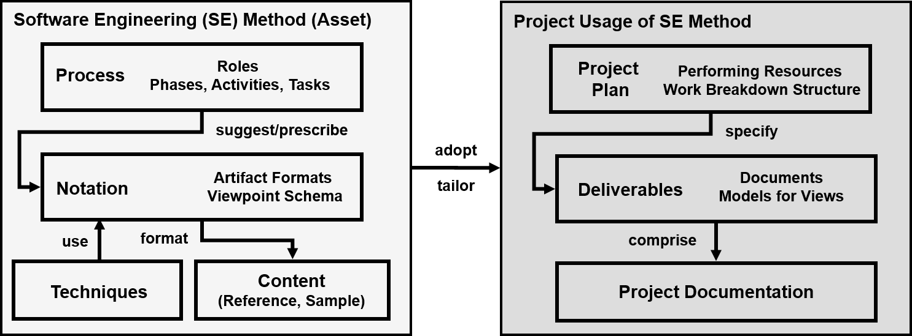

<!--
# SPDX-FileCopyrightText: 2020 Copyright Olaf Zimmermann https://ozimmer.ch/about/
#
# SPDX-License-Identifier: CC-BY-4.0
-->

# Software/Service/API Design Practice Repository (DPR)

<!-- "DPR" pronounced "deeper"... and Se (or C?) can be pronounced "see", so [O] see deeper :-) -->

Welcome to DPR (pronounced "deeper")! This public repository collects and references methods elements and practices from various methods (old and new) that are applicable to service analysis and design (and beyond).

## Target Audience 

Here's the roles we have created this repository for, ordered from specific to generic:

* [(Micro-)service](https://medium.com/olzzio/seven-microservices-tenets-e97d6b0990a4) designers
* API product managers/owners, developers, testers, maintainers 
* Software architects specializing on application integration 
* Any software architect 
* Any software engineer


## Overview and Quick Links

<!-- TODO (v2.1) add simple miro or other diagram (with hyperlinks!) here -->

DPR contains three types of method/practice elements:

* The [artifact and template descriptions folder](artifact-templates) might be a good first stop. 
    * Try [Y-statements as Architecture Decision Records](artifact-templates/DPR-ArchitecturalDecisionRecordYForm.md).
* Next up: [activities and techniques](activities)
    * Start with our [stepwise service design (contract first)](activities/SDPR-StepwiseServiceDesign.md) practice.
* Also there, but not very deeply populated: [roles and personas](./roles).
    * [Application Architect](roles/DPR-ApplicationArchitectRole.md), [API Product Owner](roles/SDPR-APIProductOwner.md)

A [quick start tutorial](tutorials/DPR-Tutorial0.md) takes you through the repository structure in a small sample scenario. The [online shop API design tutorial](tutorials/DPR-Tutorial1.md) (under construction) is a good starting point if you like to learn by example and have a little more time. <!-- Not there yet: [examples](./examples) --> 

We also provide some [background information](./background-information) on methods and practices, including a [bibliography](/./background-information/literature.md).


## Terminology Clarification

### (Micro-)Services and SOA Definitions

According to Martin Fowler, a service is a component with a remote Application Programming Interface (API). And services and their APIs [come in different sizes](https://ozimmer.ch/patterns/2020/07/06/MicroservicePositions.html), hence an engineering approach to designing them is required. That's all there is to say!

If you want more conceptual clarifications, see this [blog post](https://ozimmer.ch/patterns/2020/07/06/MicroservicePositions.html), this [presentation](https://vss.swa.univie.ac.at/2019/wp-content/uploads/2019/08/ZIO-DomainDrivenServiceDecompositionMAP2019v13p.pdf) or this [article](http://rdcu.be/mJPz) for a definition of microservices and positioning as an implementation approach to SOA.

The [Microservice API Patterns (MAP) website](https://microservice-api-patterns.org/), [introduction](https://drops.dagstuhl.de/opus/volltexte/2020/11826/) and [pattern papers](https://microservice-api-patterns.org/publications#interface-evolution-patterns--balancing-compatibility-and-extensibility-across-service-life-cycles) go even deeper and introduce terms such as endpoint, operation and message representations. 

### Method Engineering

Our metamodel is an adoption of the related work chapter in Olaf Zimmermann's PhD thesis report ["An architectural decision modeling framework for service-oriented architecture design"](https://elib.uni-stuttgart.de/handle/11682/2682): 



This terminology maps to that of other method engineers like this<!-- TODO (v2): work in progress, review terms, add link to sit meth eng -->:

| This repository | Agile community ([glossary](https://www.agilealliance.org/agile101/agile-glossary/))| OMG SPEM 2.0 ([PDF](https://www.omg.org/spec/SPEM/2.0/PDF)) | [Open Unified Process (UP)](https://download.eclipse.org/technology/epf/OpenUP/published/openup_published_1.5.1.5_20121212/openup/index.htm) and other methods |
|-|-|-|-|
| [Role](./roles) | Persona, team member | Role | Stakeholder |
| [Activity](activities) (with steps) | n/a (not plan-driven, backlog item types come close)  | Task (with Steps) | UP: Activity <!-- TODO check --> |
| [Artifact](artifact-templates) | no direct pendant (Template? Documentation?) |  Work product | UP: Artifact |
| Technique (part of activity description)| Practice | no direct pendant (Tool comes close) | UP: Guide, guidance |

<!-- In SOAD, a phase has tasks, which in turn has steps; DPR is flat at present (folder) -->

In short, *activities* describe work to be done, *techniques* (or practices) help doing so; more than one technique might support an activity. For instance, use case modeling and user story telling are two techniques to elicit functional requirements. *Artifacts* are deliverables of activities, *templates* suggest content and structure for them. For instance, an architectural decision log (an artifact) may come in the form of a [Nygard Architecture Decision Record (ADR)](http://thinkrelevance.com/blog/2011/11/15/documenting-architecture-decisions), as a [Y-statement](https://medium.com/@docsoc/y-statements-10eb07b5a177), as a [Tyree/Akerman table](https://ieeexplore.ieee.org/document/1407822), etc. *Techniques* and tools support and/or partially automate the activities.

The above terms establish an [ubiquitous language](https://martinfowler.com/bliki/UbiquitousLanguage.html) (or domain model) of service design and agile architecting &mdash; in the (bounded) context of this repository &#128521; 


##  Acknowledgments 

The creation and release of DPR was partially supported by the project "Domain-Driven Digital Service Engineering" funded by the [Hasler Foundation](https://haslerstiftung.ch/en/welcome-to-the-hasler-foundation/).

Contributors (input, technical writing, feedback): 

* [Olaf Zimmermann (ZIO)](https://ozimmer.ch)
* [Mirko Stocker (STX)](https://www.linkedin.com/in/misto/)

Stefan Kapferer and Oliver Kopp reviewed selected repository content and structure. Many members of our professional networks provided input and/or inspiration through discussions, workshops, joint client projects and many other ways. Thank you!


## Getting Involved 

If you would like to help improve this collection of software/service/API design practices:

* Feel free to create GitHub issues.
* Submit pull requests. If you do so, we assume that you own the IP you submit, agree to open source it under the license of this repository and therefore comply with this [Developer Certificate of Origin](https://developercertificate.org/). 
    * The [contributing](./contributing) folder has templates for artifact, activity, role descriptions.
* [Contact us](https://ozimmer.ch/about/) to discuss collaboration and integration opportunities.

More information can be found [here](contributing/CONTRIBUTING.md).


## DPR Metadata 

```yaml
title: Design Practice Repository (DPR)
owner: Olaf Zimmermann (ZIO)
date: "10, 01, 2020 (Source: Project DD-DSE)"
copyright: Copyright 2020 Olaf Zimmermann (unless noted otherwise). All rights reserved.
```

<!-- TODOs: 1. use ISO date format yyyy-mm-dd 2. add SPDX license identifier and metadata -->

### License

<a rel="license" href="http://creativecommons.org/licenses/by/4.0/"></a><br />This work is licensed under a <a rel="license" href="http://creativecommons.org/licenses/by/4.0/">Creative Commons Attribution 4.0 International License</a>.
