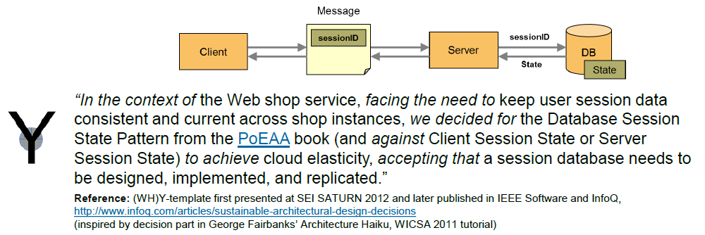

<!--
#### Performing Roles and Related Artifacts (Synopsis)
|**Role**| Input | Output | Comments and Pointers |
|:-------|:-----:|:------:|:---------------------:|
|   | ) |  |  |
-->

Practice: *Architectural Decision Capturing*
--------------------------------------------
also known as: Decision Log(ging)

### Context 
Each software system has an architecture, which is defined by the set of [architectural decisions](https://en.wikipedia.org/wiki/Architectural_decision) made. Hopefully, these decisions are made consciously and continuously, and consensus is reached about them. This decision making progress should be recorded to avoid knowledge vaporization.

*Note:* Not all organizations can or want to follow a "products over projects" philosophy; team members come and go, e.g., external consultants. Some of these tend to apply the "I know better, why haven't you done this and that?" tactic when joining and forget to document their legacy when leaving. Keeping a decision log current is a good safety belt in such (and similar) situations.


### Purpose (When to Use and When not to Use)
*As a technical team lead (architect, lead developer, product manager), I want to keep track of the results of all architecture design activities in a compact and searchable form so that newcomers can get a quick overview of the key decisions made and the entire team (and interested external stakeholders) have a single point of reference when making follow-on decisions.* 

From a quality point view, look for accountability (of decision makers), consistency (between decisions, between decisions and implementation artifacts), and continuity (or currentness of the design artifacts).

There are no reasons not to capture decisions. Two variants exist, *continuous architectural decision capturing* and *stage-based architectural decision capturing*. A stage refers to a phase or iteration, for instance a sprint in Scrum and other agile methods.


### Instructions (Synopsis, Definition)
<!-- What to do, artifact to produce; minimum, medium maximum diligence/verbosity (?)-->   
*Keep a log of architectural decisions in a single place that is accessible to the entire team*. 

This can, for instance, be a team-wide source modeling or code repository, a project-wide wiki, or a shared office document (word processor, spreadsheet). As the first decision to be captured, select a *verbosity level* for the decision log: 

- At a minimum, document the decision outcome ("we chose") and provide basic rationale (for instance, in the form of a "because" half sentence).
- On a medium level of verbosity, use one of the lean *Architectural Decision Record (ADR)* templates such as [MADR](https://github.com/adr/madr), [Y-Statements](http://www.sei.cmu.edu/library/abstracts/presentations/zimmermann-saturn2012.cfm) or [Nygard's ADRs](http://thinkrelevance.com/blog/2011/11/15/documenting-architecture-decisions). 
- If needed or desired, for instance due to external stakeholder pressure to reach certain compliance or maturity levels, apply one of the full-fledged decision modeling templates from the literature.

<!-- TOOO visualize ecADR from DoD post in miro -->


### Examples
An example of a minimal decision capture is: 

~~~
ADR-001: We decided for MySQL as our relational database in the backend because this database has been approved strategically by our EAM group, has good tool support and sufficient performance under the workload that we expect to be caused by the user stories to be implemented in the next 10 sprints.
~~~

Slide 18 in a [SAGRA 2016 keynote](https://sagra2016.files.wordpress.com/2016/10/zio-towardsopenleanarchitectureframework-sagranov2016v10p.pdf) features a medium-verbose ADR:



See [this SATURN 2010 presentation](http://resources.sei.cmu.edu/library/asset-view.cfm?assetid=22124) for a high-fidelity example (slide 14). 


### Benefits vs. Effort (Expected Benefits, Skill Levels)
There are few short-term incentives for decision capturing, which has been reported to pay off in the medium to long time. Many architects report that out of all views on software architecture they provide in their software architecture documents, the decision log has been read and commented on and appreciated the most. No special skills are required; anybody who can make a decision (or contribute to a collaborative decision making effort) should be able to capture the outcome and the supporting arguments. 

Comparing the two definitions of software architecture (components and connectors vs. set of design decisions), one can view the latter as the software engineering/architecting process equivalent of [event sourcing](https://martinfowler.com/eaaDev/EventSourcing.html), with all its pros and cons. 


### Hints and Pitfalls to Avoid

See an [InfoQ article](https://www.infoq.com/articles/sustainable-architectural-design-decisions) for tips and tricks.

Some additional rules of thumb: 

* Stick to one template throughout a project; it is less relevant which one you pick --- as long as you pick one.
* Focus on the essence of the decision, but make sure the individual ADRs and the entire decision log can serve their purpose (see above): quick orientation, long time reference.
* Do not spend more time on decision capturing than on decision making (and preparing this activity).
* Assign an identifier and create minimal meta information such as decision owner/makers, status, and timestamp.


### Origins and Signs of Use
*Origins*. AD capturing has been a key element in iterative and incremental SE methods such as (R)UP and IBM UMF (and its predecessors) since the late 1990s. For instance, OpenUP has the notion of an *Architecture Notebook* that calls for decision capturing with a justification as a mandatory element even in minimal project  documentation. The term *rationale* also appears in one of the first articles that defined software architecture (by Perry/Woolf). Book authors have always seen decisions to take center stage in architecture design process; see, for instance, works by SEI authors including Attribute-Driven Design (ADD) 3.0, but also patterns books and supporting material such as [this rambling](http://www.enterpriseintegrationpatterns.com/ramblings/86_isthisarchitecture.html) on the Enterprise Integration Patterns website. George Fairbanks suggests a single-sentence decision outcome overview as part of his *Architecture Haiku*, also used by Michael Keeling [here](https://www.neverletdown.net/2015/03/architecture-haiku.html).

Around 2014, research sub-community jumped on the topic at conferences such as WICSA and workshops such as SHARK. Decision rationale also is a mandatory element in the [ISO/IEC/IEEE 42010:2011, Systems and software engineering – Architecture description](http://www.iso-architecture.org/ieee-1471/). The lean and agile communities talk about deferring decisions until the last (but not the least) responsible moment; for instance, M. Nygard [suggested the ADR format in November 2011](http://thinkrelevance.com/blog/2011/11/15/documenting-architecture-decisions). Many organizations and teams design their own templates, some of which are based on those in the literature; others are custom made, applying common sense and practices from other fields. 

See the blog post["Architectural Decisions — The Making Of"](https://ozimmer.ch/practices/2020/04/27/ArchitectureDecisionMaking.html) for more history and context information.  

*Signs of Use*. Filled out templates obviously indicate that decisions are made and captured explicitly. But informal justifications, for instance in the form of "we did this ... because ..." also qualify. 


### Related Content (in DPR) 

#### Performing Roles and Related Artifacts (Synopsis)

* Enterprise architects, program/portfolio architects  
* Agile teams 

* [Application Architect](../roles/DPR-ApplicationArchitectRole.md) 
* [Decision Log with ADRs](../artifact-templates/DPR-ArchitecturalDecisionRecordYForm.md)


#### Other Practices (Alternatives)
There are no alternatives, really. The emergent architecture community suggests not to make ADs consciously, but let the architecture emerge and evolve through frequent iterations including intense refactoring supported by measurements/experiments. 

The Agile Alliance lists a [Quick Design](https://www.agilealliance.org/glossary/quickdesign/) practice in its [Agile Glossary](https://www.agilealliance.org/agile101/agile-glossary/). The outcome of such quick design sessions can be captured as an ADR in the decision log.

Agile Modeling has the notion of [Architecture Envisioning](http://agilemodeling.com/essays/initialArchitectureModeling.htm), which yields strategic, high-impact decisions. Not even the most extreme agile team will replace is database paradigm, technology, and provider in each and every sprint.


### More Information 
See ["Y-Statements"](https://medium.com/@docsoc/y-statements-10eb07b5a177) post on Medium and [slides 51 and 52 in this presentation](http://resources.sei.cmu.edu/asset_files/Presentation/2012_017_001_31349.pdf) for examples of good and bad justifications; for instance, "will look good on my CV" does not qualify as a sound decision rationale for a technology selection decision (although it is understandable to come up with such argument 😉).

[This website](https://www.ifs.hsr.ch/index.php?id=13191&L=4) and [this paper](http://www.ifs.hsr.ch/fileadmin/user_upload/customers/ifs.hsr.ch/Home/projekte/ADMentor-WICSA2015ubmissionv11nc.pdf) provide an overview of selected existing templates for AD capturing and decision logging (both lean and full-fledged). 

The [adr organization at GitHub](https://adr.github.io/) also compiles AD templates, as well as tools and other resources.

See this [SATURN 2013 BoF session report](http://www.sei.cmu.edu/library/assets/presentations/zimmermann-saturn2013.pdf) for a cost-benefit discussion and open research questions.

Finally, there is a proposed for ["A Definition of Done for Architectural Decision Making"](https://ozimmer.ch/practices/2020/05/22/ADDefinitionOfDone.html).


### Data Provenance 

```yaml
title: "Design Practice Repository (DPR): Architectural Decision Capturing"
author: Olaf Zimmermann (ZIO)
date: "02, 26, 2020 (Source: Project DD-DSE)"
copyright: Olaf Zimmermann, 2020-2021 (unless noted otherwise). All rights reserved.
license: Creative Commons Attribution 4.0 International License
```
