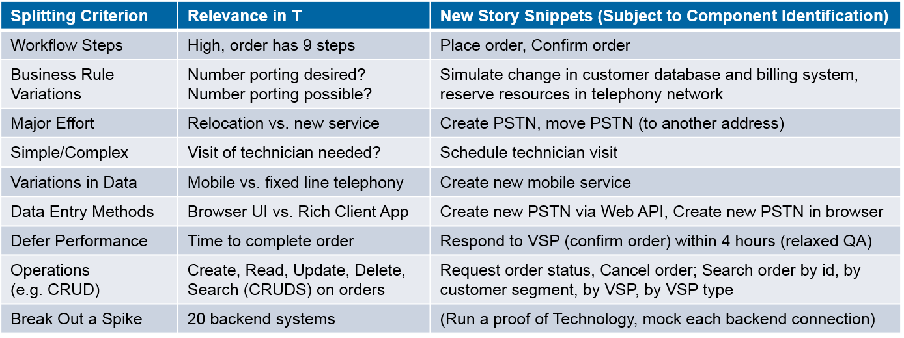

<!-- Word budget: 1000-1500 (3-5 A4 pages); the practice descriptions should be readable in 5 to 10 minutes (expert vs. novice reader) -->

Activity/Technique: *Story Splitting*
-------------------------------------

### Context
<!-- Keywords, preconditions (input artifacts), performing role -->
A [user story](../artifact-templates/DPR-UserStory.md) that is too large for a sprint must be broken down to meet the [INVEST properties](https://xp123.com/articles/invest-in-good-stories-and-smart-tasks/) (established by B. Wake):

* *Independent:* Stories should not overlap conceptually and not dictate any particular implementation order.
* *Negotiable:* Stories are supposed to be "co-created by the customer and programmer during development. A good story captures the essence, not the detail."
* *Valuable:* Each story must be valuable to the customer on its own. <!-- "Developers may have (legitimate) concerns, but these framed in a way that makes the customer perceive them as important." --> 
* *Estimable:* The level of detail should be "just enough to help the customer rank and schedule the story’s implementation."
* *Small:* "Stories typically represent at most a few person-weeks worth of work." Some teams size their stories in such a way that they can be implemented in a single iteration.
* *Testable:* Customer and developers should understand a story well enough so that a test for it can be written &mdash; or is written first, as in BDD and TDD (see this [blog post](https://ozimmer.ch/index/2020/10/30/DrivenByTLAs.html) for a collection of these two and many more "driven" methods).

Several INVESTment practices and techniques exist; one of them is story splitting.

### Goal and Purpose (When to Use and When not to Use)
<!-- TODO, can be a user story, must identify the performing role and the target audience (producer, consumer) -->
Story splitting makes stories and their implementation easier to plan and execute. 

Switching to a different set of [stakeholder concerns](https://ozimmer.ch/practices/2020/11/19/ExtraExtraReadAllboutIt.html) and viewpoint, the same practice can be used to identify candidate components in [architecture design](DPR-ArchitectureModeling.md). Many (but not all) splitting patterns and techniques are equally suited for this second, extended use of the practice.


### Instructions (Synopsis, Definition)

**Splitting patterns.** R. Lawrence describes nine splitting patterns in ["Patterns for Splitting User Stories"](https://agileforall.com/patterns-for-splitting-user-stories/), including:

* *Data entry* methods, for instance multiple actors/users and/or technical channels (Web, mobile app and so on)
* *Workflow* step, from process initiation to processing activities (possibly in parallel) and data manipulations to process termination 
* *Business rule* variations: domain decisions to be made at runtime, conditions and constraint checking
* *Data variations*: is-a relations, categorizations and classifications, domain partitioning  
* *Operations* completion: create, read, update (full, partial), delete; search, find, archive; undo (compensation)

Each data entry split suggests at least one presentation layer component (as a candidate). Complex workflows call for explicit state management, to be designed architecturally and assigned as a responsibility to one or more components. Each business rule has to be implemented and enforced somewhere (see below for a discussion of the term in this context). Data variations and operations find their place in the [Domain Model](../artifact-templates/DPR-DomainModel.md) as well as the data access/data source and persistence layer of the application system under construction. <!-- TODO could add a table mapping the splitting patterns to logical layers and patterns/component types -->

The remaining patterns are useful for planning iterations, but less relevant for component identification and architecture design (unlike their output, which might yield additional candidate components): 

* Investigation vs. implementation architectural *spike* vs. full implementation 
* *Major effort* 
* *Simple/complex*
* *Defer performance* 

**Other splitting criteria.** B. Wake suggested ["Twenty Ways to Split Stories"](https://xp123.com/articles/twenty-ways-to-split-stories/). 

M. Cohn proposed five techniques under the moniker *SPIDR*, [explained in this blog post](https://blogs.itemis.com/en/spidr-five-simple-techniques-for-a-perfectly-split-user-story) by K. Lattenkamp: Spikes, Paths, Interfaces, Data, Rules. 


### Example(s)
Let us assume this top-level story (a.k.a. epic) from a telecommunications order management scenario:

```plain
"As a Virtual Service Provider (VSP) and client of the PSTN (Public Switched Telephone Network) provider 'T', 
I would like to create telephony orders on behalf of my end customers rapidly and reliably 
so that they are satisfied and stay with me rather than switch to T or another VSP."
```

Applying the splitting patterns may yield a result like this: <!-- IH CE: capitalization? confirm vs. technology -->



<!-- replace with Spinnaker table from exercise? (and more text in sample solution? Mirko: Die Tabelle ist gut, aber es wäre schön, wenn man am Ende auch wieder Stories resultieren. -->


### Benefits vs. Effort (Expected Benefits, Skill Levels)
<!-- From AA, should call out what one needs to be able to do on beginner, intermediate, advanced level; as a team -->
Story splitting is a very light technique. A single application of it (one pattern applied to one story) will only take a few moments. It does not require any particular, specialized skills; its positive effects should become apparent immediately: more actionable backlog items, more expressive, problem- and/or domain-specific architecture models (component diagrams in particular).

A very welcome effect of story splitting is that it often leads to new questions to the domain experts and sparks interesting conversations with them (for instance, about workflow steps and data variations).


### Hints and Pitfalls to Avoid (Common Pitfalls)
<!-- See ART, don’t overdo etc. -->
One should not get carried away by dreaming up data entry and data variations, business rules nobody has asked for, and so on.


### Origins and Signs of Use
<!-- From PLOPs and from AA -->
The Wayback Machine (a.k.a. Internet Archive) keeps early posts about story splitting [here](https://web.archive.org/web/20120909082905/http://lassekoskela.com/thoughts/7/ways-to-split-user-stories/) and [here](https://web.archive.org/web/20120716060616/http://jbrains.ca/permalink/how-youll-probably-learn-to-split-features).

Signs of use are difficult to call out for this activity. Backlog size and structure might indicate use. <!-- TODO How about CI/CM? --> 


### Related Content
<!-- in DPR/OLAF and elsewhere -->

<!-- TODO (v2) [O] discuss "use case splitting": patterns applicable to (brief) stories too, full scenarios can be seen as application/variant of the workflow splitting pattern; UML relations -->

#### Performing Roles and Related Artifacts (Synopsis)

* Application architects
* API designers 
* Agile developers


#### Practices and Techniques (Refinements, Guides)

Story splitting operates on backlog items such as [User Stories](../artifact-templates/DPR-UserStory.md). Story splitting can be followed or accompanied by [Tactic DDD](DPR-TacticDDD.md).

[Event storming](https://en.wikipedia.org/wiki/Event_storming) can either trigger story capturing and splitting, or be performed when following business events and workflow steps. 

[Story Mapping](https://www.agilealliance.org/glossary/storymap/) and [Example Mapping](https://cucumber.io/blog/bdd/example-mapping-introduction/) are two related, complementary practices. Split stories can be mapped more easily than larger ones. More specifically, splitting by workflow step is straightforward to combine with/use to populate the horizontal dimension in story maps; the other patterns all fit the vertical "details" dimension. Example mapping also talks about business rules, in the sense of a constraint that must be met. Any story can serve as input; the broader and complex it is, the longer and more intense clarification discussions will results. The more specific and simple a story is, the easier it will be to find the acceptance criteria for it. 


### More Information 
<!-- Further Reading, Academic Publications) -->
The [Agile Glossary](https://www.agilealliance.org/agile101/agile-glossary/) has an entry for [Story Splitting](https://www.agilealliance.org/glossary/split/).

Agile for All provides a [Cheat Sheet](https://agileforall.com/wp-content/uploads/2009/10/Story-Splitting-Cheat-Sheet.pdf) that summarizes the patterns. 

T. Heap, a business analyst, [puts the splitting steps in a logical order](http://www.its-all-design.com/how-to-split-user-stories/) and also touches upon API design.


### Data Provenance 

```yaml
title: "Design Practice Repository (DPR): Practice/Technique Story Splitting"
author: Olaf Zimmermann (ZIO)
date: "01, 29, 2021"
copyright: Copyright 2020-2021 Olaf Zimmermann. All rights reserved.
license: Creative Commons Attribution 4.0 International License
```


