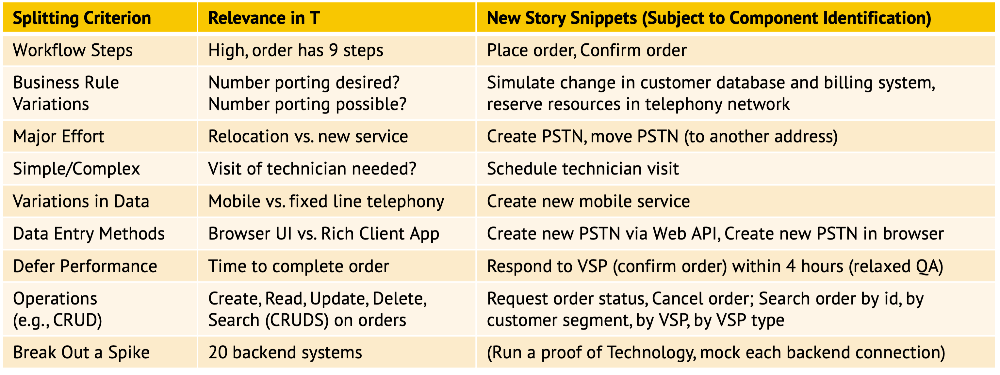

<!-- Word budget: 1000-1500 (3-5 A4 pages); the practice descriptions should be readable in 5 to 10 minutes (expert vs. novice reader) -->

Activity/Technique: *Story Splitting*
-------------------------------------

### Context
<!-- Keywords, preconditions (input artifacts), performing role -->
A story that is too large for a sprint must be broken down to meet the [INVEST properties](https://xp123.com/articles/invest-in-good-stories-and-smart-tasks/) of user stories:

* *Independent:*: Stories should not overlap conceptually and not dictate any implementation order.
* *Negotiable:* Stories are supposed to be "co-created by the customer and programmer during development. A good story captures the essence, not the detail."
* *Valuable:* Each story must be valuable to the customer on its own. <!-- "Developers may have (legitimate) concerns, but these framed in a way that makes the customer perceive them as important." --> 
* *Estimable:* The level of detail should be "just enough to help the customer rank and schedule the story’s implementation."
* *Small:* "Stories typically represent at most a few person-weeks worth of work."
* *Testable:* customer and developers should understand the story well enough that a test for it can be written --- or is written first, as in BDD and TDD, see this [blog post](https://ozimmer.ch/index/2020/10/30/DrivenByTLAs.html).

Several techniques exist; one of them is story splitting.

### Goal and Purpose (When to Use and When not to Use)
<!-- TODO, can be a user story, must identify the performing role and the target audience (producer, consumer) -->
Story splitting is an agile practice that makes stories and their implementation easier to plan. 

The same practice can be used to identify candidate components in architecture design.  


### Instructions (Synopsis, Definition)

**Splitting patterns.** R. Lawrence describes nine splitting patterns in ["Patterns for Splitting User Stories"](https://agileforall.com/patterns-for-splitting-user-stories/), including:

* *Data entry* methods, for instance multiple actors/users and/or technical channels (Web, mobile app and son on)
* *Workflow* step: sequencing from process initiation to processing activities (possibly in parallel) and data manipulations to process termination 
* *Business rule* variations: domain decisions to be made, conditions and constraint checking
* *Data variations*: is-a relations, categorizations and classifications, domain partitioning  
* *Operations completeness*: create, read, update (full, partial), delete; search, find, archive; undo (compensation)

<!-- TODO could add a table mapping the splitting patterns to logical layers and patterns/component types -->

The remaining patterns are useful for planning iterations, but less relevant for component identification: 

* Investigation vs. implementation: architectural *spike* vs. full implementation 
* (Major) *effort* and *simple/complex*; *defer performance* 

**Other splitting criteria.** B. Wake suggested [Twenty Ways to Split Stories](https://xp123.com/articles/twenty-ways-to-split-stories/). M. Cohn listed five techniques under the moniker [SPIDR](https://blogs.itemis.com/en/spidr-five-simple-techniques-for-a-perfectly-split-user-story): Spikes, Paths, Interfaces, Data, Rules. 


### Example(s)
Let us assume this top-level story (a.k.a. epic) from a telecommunications order management scenario:

```
"As a Virtual Service Provider (VSP) and client of 'T', 
I would like to create telephony orders on behalf of my end customers rapidly and reliably 
so that they are satisfied and stay with me rather than switch to T or another VSP.".
```

Applying the splitting patterns may yield a result like this:


<!--  -->
<!-- replace with Spinnaker table from exercise? (and more text in sample solution? -->


### Benefits vs. Effort (Expected Benefits, Skill Levels)
<!-- From AA, should call out what one needs to be able to do on beginner, intermediate, advanced level; as a team -->
This is a very light technique, a single application (of one pattern to one story) will only take a few moments. It does not require any particular, specialized skills and its positive effects should become apparent immediately: more actionable backlog items, more expressive, problem- and domain-specific architecture models (component diagrams in particular).


### Hints and Pitfalls to Avoid (Common Pitfalls)
<!-- See ART, don’t overdo etc. -->
The only warning of danger is not to overdo it; do not carried away by dreaming up data entry and data variations, business rules nobody has asked for, etc.


### Origins and Signs of Use
<!-- From PLOPs and from AA -->
The Wayback machine has archived early posts about story splitting [here](https://web.archive.org/web/20120909082905/http://lassekoskela.com/thoughts/7/ways-to-split-user-stories/) and [here](https://web.archive.org/web/20120716060616/http://jbrains.ca/permalink/how-youll-probably-learn-to-split-features).

Signs of use are difficult to call out for this activity. Backlog size and structure might indicate use. <!-- TODO How about CI/CM? --> 


### Related Content
<!-- in DPR/OLAF and elsewhere -->

#### Performing Roles and Related Artifacts (Synopsis)

* Application architects
* API designers 
* Agile developers


#### Practices and Techniques (Refinements, Guides)

[Story Mapping](https://www.agilealliance.org/glossary/storymap/) and [Example Mapping](https://ecsa2020.disim.univaq.it/details/ecsa-2020-keynotes/3/Mighty-Methods-Four-Essential-Tools-for-Every-Software-Architect-s-Silver-Toolbox) are two related, complementary practices.


### More Information 
<!-- Further Reading, Academic Publications) -->
The [Agile Glossary](https://www.agilealliance.org/agile101/agile-glossary/) has an entry for [Story Splitting](https://www.agilealliance.org/glossary/split/).

Agile for All provides a [Cheat Sheet](https://agileforall.com/wp-content/uploads/2009/10/Story-Splitting-Cheat-Sheet.pdf) that summarizes the patterns. 

<!-- TODO use AppArch exercise 5 and slides -->


### Data Provenance 

```yaml
title: "Design Practice Repository (DPR): Practice/Technique Story Splitting"
author: Olaf Zimmermann (ZIO)
date: "12, 04, 2020"
copyright: Copyright 2020 Olaf Zimmermann. All rights reserved.
license: Creative Commons Attribution 4.0 International License
```


