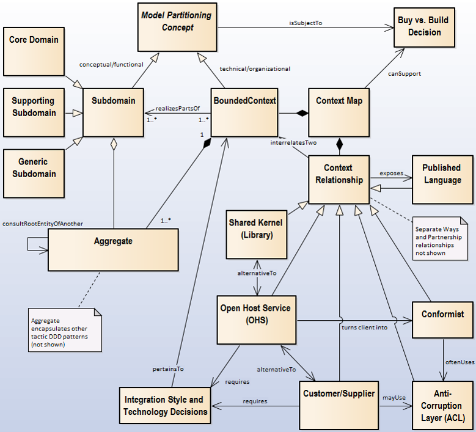

<!-- Word budget: 1000-1500 (3-5 A4 pages); the practice descriptions should be readable in 5 to 10 minutes (expert vs. novice reader) -->

Activity/Technique: *Strategic DDD*
-----------------------------------


### Context
Tactic DDD deals with implementing domain layer components; strategic DDD deals with integrating these components and managing complexity in end-to-end application landscapes for the long run. In small projects and businesses such long-time perspective might not be needed, but how about the many software development projects and development organizations at large software-intensive firms? The interfaces between system and teams have to be managed somehow, either centrally (this would be the task of enterprise architecture efforts) or decentrally (for instance, via Scrums of Scrums in the Scaled Agile Framework, SAFe). Strategic DDD provides patterns and a simple diagram type to support such efforts.


### Goal and Purpose (When to Use and When not to Use)
According to an [InfoQ article on strategic DDD](https://www.infoq.com/articles/ddd-contextmapping) that develops an example in several steps, there are four particular reasons to bother about model partitioning and model/context boundaries:

* Same term, different meaning (homonym)
* Same concept, different use (polyseme)
* External system differences (heterogeneity)
* Scaling up the organization (multiple teams) 


### Instructions (Synopsis, Definition)

The key pattern in strategic DDD is *Bounded Context*, an abstraction of a functional area, system (from different viewpoints) or team:

* "A description of a boundary (typically a subsystem, or the work of a particular team) within which a particular model is defined and applicable” (@Evans:2003).
* "A bounded context is an explicit boundary within which a domain model exists. Inside the boundary, all terms and phrases of the Ubiquitous Language have specific meaning, and the model reflects the language with exactness” (@Vernon:2013). 
* M. Fowler emphasizes that a bounded context is explicit about its interrelationships in his [bliki article on Bounded Contexts](http://martinfowler.com/bliki/BoundedContext.html).



The original DDD book (@Evans:2003) defined an initial set of relations between contexts appearing in a map, e.g., the *Conformist* pattern. Later on, a few additional types were added, for instance *Partnership* and *Big Ball of Mud*. Summaries of the patterns from the original DDD book as well as a few extensions are available for free download in the book ["Domain-Driven Design Reference"](http://www.domainlanguage.com/wp-content/uploads/2016/05/DDD_Reference_2015-03.pdf), also by E. Evans: <!-- double check whether quotes come from book or secondary literature (online post?) -->

* *Shared Kernel*: "Two bounded contexts use a common kernel of code (for example a library) as a common lingua-franca, but otherwise do their other stuff in their own specific way."
* *Open Host Service (OHS)*: "A Bounded Context specifies a protocol by which any other bounded context can use its services (e.g. a RESTful HTTP service or a SOAP Web service). This protocol exposes the Published Language."
* *Published Language (PL)*: "The interacting bounded contexts agree on a common a language (for example a bunch of XML schemas over an enterprise service bus) by which they can interact with each other."
* *Customer/Supplier* (a.k.a. Customer/Supplier Teams/Development): "One bounded context uses the services of another and is a stakeholder (customer) of that other bounded context. As such it can influence the services provided by that bounded context."
* *Conformist*: "One bounded context uses the services of another but is not a stakeholder to that other bounded context. As such it uses "as-is" (conforms to) the protocols or APIs provided by that bounded context."
* *Anti-Corruption Layer (ACL)*: "One bounded context uses the services of another and is not a stakeholder, but aims to minimize impact from changes in the bounded context it depends on by introducing a set of adapters – an anti-corruption layer."
* An additional relation is *Separate Ways*, if you decide not to collaborate and/or integrate two bounded contexts.

<!-- Mirko: Eine sehr schöne Zusammenfassung und Einführung! O: Thx! Aus AppArch Fact Sheet -->

The relationship types are organizational patterns (not technical ones); they differ regarding the following design concerns: 

* Topology: Local vs. remote? 
* Visibility (of collaboration/communication partners to each other)? 
* (A)symmetry of relationship? 
* Amount of control and influence for client/consumer?

In Strategic DDD, you basically have to identify Bounded Contexts and then answer these questions to end up at the right pattern for any given relationship. [Context Mapper](https://contextmapper.org/docs/bounded-context/) can help you do so; it features DDD patterns and enforces additional semantic valiation rules. 

The resulting [Context Map](../artifact-templates/DPR-StrategicDDDContextMap.md) can drive the architectural decision making in API design. Follow-on decisions pertain the integration style technology and style. The relationship types do not exclude, but complement each other by default. 


### Example(s)
The [Context Mapper website](https://contextmapper.org/docs/examples/) provides a number of examples of tactic and strategic, including a model of the [Lakeside Mutual](https://github.com/ContextMapper/context-mapper-examples/tree/master/src/main/cml/insurance-example) microservices ecosystem:


### Benefits vs. Effort (Expected Benefits, Skill Levels)
This [OOSPLA experience report](https://dddcommunity.org/wp-content/uploads/files/practitioner_reports/landre_einar_2006_part1.pdf) makes the case for strategic DDD. 


### Hints and Pitfalls to Avoid (Common Pitfalls)

* Never forget whom you build a system for; do not get hung up in pattern philosophy or technical details.
* Read Chapters 2, 3, 10 and 13 in "Implementing Domain-Driven Design", for instance for a clarification of the relationships between subdomains and bounded contexts.
* Find more hints in the booklet ["The Anatomy Of Domain-Driven Design"](https://leanpub.com/theanatomyofdomain-drivendesign).


### Origins and Signs of Use
Strategic DDD was introduced in E. Evans' original DDD @Evans:2003, but featured even more prominently later in "Implementing Domain-Driven Design" by V. Vernon @Vernon:2013. 

Usage of the pattern names and presence of context maps, either drawn informally or modelled in a tool, indicate use.


### Related Content

* Tactic DDD
* System Context Diagram
* Stepwise service design 


### Performing Roles and Related Artifacts (Synopsis)

* Enterprise architects, program/portfolio architects  
* Agile teams 

<!--
|**Role**| Input | Output | Comments |
|:-|:-----:|:------:|:--------:|
|  |  |  |  |
-->


### Practices and Techniques (Refinements, Guides)

* Event Storming, for instance introduced [here](https://www.ibm.com/cloud/architecture/architecture/practices/event-storming-methodology-architecture) and tool-supported as described [here](https://contextmapper.org/docs/event-storming/)
* Lean [Wardley Mapping](https://learnwardleymapping.com/) to capture strategic intent.
* Enterprise Architecture Management (EAM) offerings and the Scaled Agile Framework (SAFe) may benefit from strategic DDD.
<!-- * Context Modeling in UML or DSL -->

There is a GitHub organization called [ddd-crew](https://github.com/ddd-crew) that features many business analysis-level extensions to DDD practices, for instance a [Bounded Context Canvas](https://github.com/ddd-crew/bounded-context-canvas) template.

### More Information 

Refer to presentations and articles by:

<!-- * A. Brandolini -->
<!-- * S. Millet -->
* M. Ploed, for instance [Visualizing sociotechnical architectures with Context Maps](https://speakerdeck.com/mploed/visualizing-sociotechnical-architectures-with-context-maps?slide=4)
<!-- * N. Tune -->
* V. Vernon has a [YouTube channel](https://www.youtube.com/channel/UCdbDxsXevDLt7EhRbi2KGjg).
* The Vaadin website also has an [introduction to strategic DDD](https://vaadin.com/learn/tutorials/ddd/strategic_domain_driven_design).


### Data Provenance 

```yaml
title: "Design Practice Repository (DPR): Practice/Technique Strategic DDD"
author: Olaf Zimmermann (ZIO)
date: "08, 15, 2020 (Source: Project DD-DSE)"
copyright: Olaf Zimmermann, 2020 (unless noted otherwise). All rights reserved.
license: Creative Commons Attribution 4.0 International License
```
