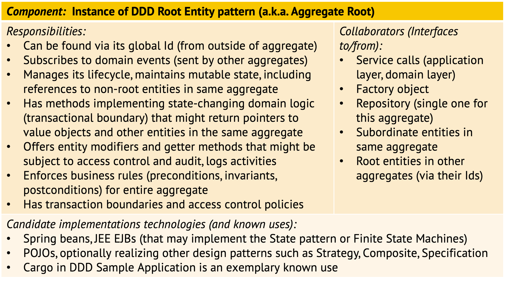
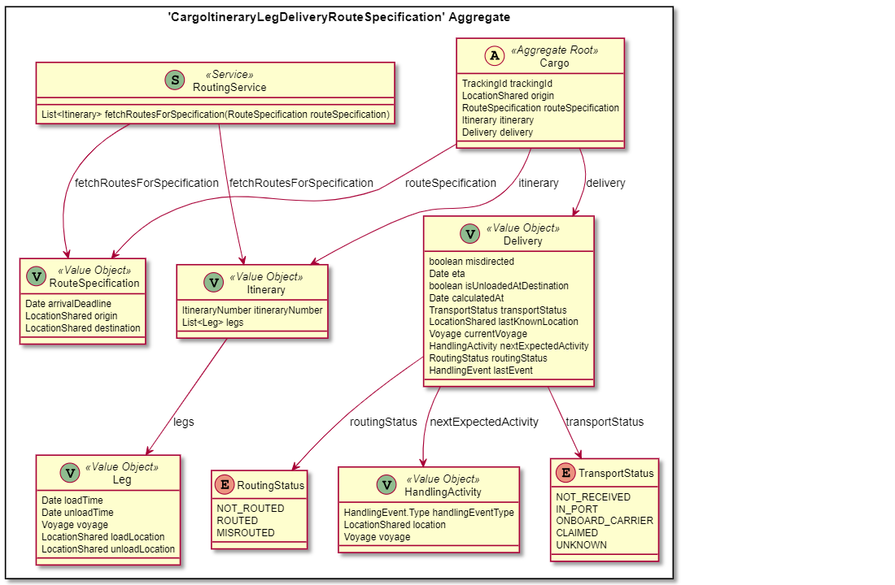

Activity/Technique: *Tactic DDD*
--------------------------------
also known as: Pattern-Oriented Object-Oriented Analysis and Design (OOAD)


### Context
*Domain-Driven Design (DDD)* proposes techniques and patterns to deal with the intrinsic complexity in software development, both organizationally and technically. Key DDD themes are business-orientation, domain modeling, and knowledge reuse both on the strategical (i.e., long term, cross-project) and on the tactical (i.e.application, project, product) level. 


### Goal and Purpose (When to Use and When not to Use)

Tactic DDD can be seen as [Object-Oriented Analysis and Design](https://en.wikipedia.org/wiki/Object-oriented_analysis_and_design) (OOAD) done right, putting emphasis on the business logic in layered architecture and decomposing the [Domain Model pattern](https://martinfowler.com/eaaCatalog/domainModel.html) from M. Fowler's @Fowler:2002. The goals of OOAD and tactic DDD are:

* Establish an [ubiquitous language](https://martinfowler.com/bliki/UbiquitousLanguage.html) with users, other external stakeholders and within the team
* Know what to implement (analysis)
* Define storage units, attributes, methods (design) 

Note the difference between analysis ("what are we building?") and design ("how will we deliver the 'what'"?), also explained in this [tutorial](https://www.tutorialspoint.com/object_oriented_analysis_design/ooad_quick_guide.htm). OOA and OOD can be performed hand in hand, and DDD supports both OOA and OOD. 


### Instructions (Synopsis, Definition)
Key patterns in tactic DDD are:

* Entity, Value Object
* Aggregate (with a single Root Entity)
* Service, Domain Event
* Factory, Repository

The original DDD book @Evans:2003 provides this pattern map for tactic DDD (showing more patterns):


Aggregates are object clusters serving as storage units, preserving consistency invariants (e.g., an order and its items). All entities and value objects in this aggregate are stored in and loaded from the database together. Entities have an identity and a life cycle; while value objects do not and are immutable. Services contain logic that cannot be easily assigned to a single entity. 

<!-- TODO (v2) explain term Aggregate Root (and entity) even more (slides?) -->

The following CRC card outlines the responsibilities and collaborations of Aggregate Roots (the root entities in an Aggregate):


**Aggregates and Business Rules.** An Aggregate in DDD is responsible for business rule enforcement across entities (single entity rules can be enforced by entity). But what is a business rule? The term has (at least) two meanings:

1. Executable part of the business logic (an algorithm) that is not expressed as sequence of statements, but declaratively. 
2. A statement or condition about the domain model, its elements and their relationships that always has to be true (i.e., be invariant) to preserve data consistency and ensure accuracy of processing. For instance, the sum of all withdrawals is equal to the sum of all payments; the total amount of player salaries on any sports team in the league does not exceed xM USD; all orders point to customers that actually exist in the real world.

<!--
More examples:

Physical containment relationship 

* No order without an existing customer
* When A changes, B also has to change 

Number calculations/value ranges 

* Total (sum) of X must not exceed value Y
* VAT calculation must match product type 
* Sum of all account transfers must always be 0

Accounting and non-repudiation 

* All calls are billed
* All access attempts are logged 
-->

The first meaning of the term is not in our focus here, but can be modeled as Entity operations and services. We are interested in the second meaning (constraint, invariant) here; such rules can and should be enforced by Aggregates.

**Modeling Steps**. In tactic DDD, an already existing OOA/OOD Domain Model is refined to call out instances of these patterns; alternatively, the pattern-oriented domain model can also be distilled from the functional requirements directly (possibly via [Subdomains](https://contextmapper.org/docs/subdomain/), another DDD pattern):

1. Distinguish Entities (stateful) and Value Objects (stateless), and expose cross-cutting or supporting code that does not fit into any class well as Services (can start with a [Transaction Script](https://martinfowler.com/eaaCatalog/transactionScript.html) per user story or use case).
2. Group output of Step 1 into Aggregates (storage units) and let Aggregates communicate state changes via Domain Events.
3. Add a Repository for each Aggregate (to implement lifecycle management) and add Factories as needed (generally speaking, never apply a pattern just because it exists; there has to be a solid business-level or technical justification for its use).


### Example(s)
The [Context Mapper website](https://contextmapper.org/docs/examples/) provides a number of examples of tactic and strategic DDD, including a model of the [Cargo example](https://github.com/ContextMapper/context-mapper-examples/tree/master/src/main/cml/ddd-sample) from the original DDD book.

The main Aggregate of the Cargo sample application is shown in the following figure. It comprises a `Cargo` Entity that aggregates different Value Objects. You might be wondering how `Delivery` can be a Value Object with that many attributes indicating some kind of lifecycle (various status attributes, current voyage, last event). If we look at [the implementation](https://github.com/citerus/dddsample-core/blob/master/src/main/java/se/citerus/dddsample/domain/model/cargo/Delivery.java), we can see that it is in fact implemented as an immutable class that creates a new `Delivery` instance when changes are made.


<!-- >  -->

<!--
png created from this puml source (had to add a blank to some relationship arrows):
~~~
@startuml

skinparam componentStyle uml2

package se.citerus.dddsample.domain.model.cargo {
	package "'CargoItineraryLegDeliveryRouteSpecification' Aggregate" <<Rectangle>> {
		class Cargo <<(A,#fffab8) Aggregate Root>> {
			TrackingId trackingId
			LocationShared origin
			RouteSpecification routeSpecification
			Itinerary itinerary
			Delivery delivery
		}
		class Delivery <<(V,DarkSeaGreen) Value Object>> {
			boolean misdirected
			Date eta
			boolean isUnloadedAtDestination
			Date calculatedAt
			TransportStatus transportStatus
			LocationShared lastKnownLocation
			Voyage currentVoyage
			HandlingActivity nextExpectedActivity
			RoutingStatus routingStatus
			HandlingEvent lastEvent
		}
		class HandlingActivity <<(V,DarkSeaGreen) Value Object>> {
			HandlingEvent.Type handlingEventType
			LocationShared location
			Voyage voyage
		}
		class Itinerary <<(V,DarkSeaGreen) Value Object>> {
			ItineraryNumber itineraryNumber
			List<Leg> legs
		}
		class Leg <<(V,DarkSeaGreen) Value Object>> {
			Date loadTime
			Date unloadTime
			Voyage voyage
			LocationShared loadLocation
			LocationShared unloadLocation
		}
		class RouteSpecification <<(V,DarkSeaGreen) Value Object>> {
			Date arrivalDeadline
			LocationShared origin
			LocationShared destination
		}
		enum TransportStatus {
			NOT_RECEIVED
			IN_PORT
			ONBOARD_CARRIER
			CLAIMED
			UNKNOWN
		}
		enum RoutingStatus {
			NOT_ROUTED
			ROUTED
			MISROUTED
		}
		class RoutingService <<(S,DarkSeaGreen) Service>> {
			List<Itinerary> fetchRoutesForSpecification(RouteSpecification routeSpecification)
		}
	}
}

Cargo -- > RouteSpecification : routeSpecification
Cargo -- > Itinerary : itinerary
Cargo -- > Delivery : delivery
Delivery -- > TransportStatus : transportStatus
Delivery -- > HandlingActivity : nextExpectedActivity
Delivery -- > RoutingStatus : routingStatus
Itinerary -- > Leg : legs
RoutingService -- > Itinerary : fetchRoutesForSpecification
RoutingService -- > RouteSpecification : fetchRoutesForSpecification

@enduml
~~~
-->

[Context Mapper](https://contextmapper.org/), a DSL and tools for strategic and tactic DDD, provides two model transformations that support the transition from user stories (or use cases) to subdomains and then bounded contexts (a strategic DDD pattern) containing Aggregates, Entities and Value Objects. An example is walked through [here](https://contextmapper.org/docs/rapid-ooad/).


### Benefits vs. Effort (Expected Benefits, Skill Levels)
According to Martin Fowler in @Fowler:2002, investing in a Domain Model makes sense if the business logic is inherently complex. 

We would argue that there hardly is any system that is simple enough not to benefit from some domain modeling and tactic DDD.


### Hints and Pitfalls to Avoid
Specific to OOAD and DDD, it is a good idea to establish naming conventions, for instance for Aggregates and their Entities. See hint 6 in ZIO's [Technical Writing Tips and Tricks](https://ozimmer.ch/authoring/2020/04/24/TechWritingAdvice.html) for rationale and additional examples.

E. Evans establishes the following design heuristics for Aggregates in his [DDD Reference](http://domainlanguage.com/wp-content/uploads/2016/05/DDD_Reference_2015-03.pdf):

* "Use asynchronous communication between Aggregates
* Give enforcement responsibilities (for invariants) to root entity, possibly supported by designated framework mechanisms (e.g., in Spring)
* Keep one Aggregate on one server, allow different Aggregates to be distributed among (hardware) nodes
* Use the same boundaries for transactions and distribution"

In "Implementing DDD", V. Vernon establishes similar rules for Aggregate design (@Vernon:2013):

* "Model true invariants in consistency boundaries.
* Design small aggregates.
* Reference other aggregates by identity.
* Use eventual consistency outside the boundary."

These nuggets of advice can also be found online in an [article series at domaindrivendesign.org](http://dddcommunity.org/library/vernon_2011/) (@Vernon:2013).


### Origins and Signs of Use
DDD has been around, in active use on real-world projects, and supported by a community since the first DDD book came out in 2003; it recently became particularly popular in the microservices community as a way to identify service boundaries (via strategic DDD). 

Tactic DDD was introduced in E. Evans' book on DDD (@Evans:2003), but featured even more deeply later in "Implementing Domain-Driven Design" by V. Vernon. 

Usage of the pattern names and presence of domain models, either drawn informally or modelled in a UML tool or DSL, indicate use.


### Related Content

* [User Stories](../artifact-templates/DPR-UserStory.md) and [Use Cases](../artifact-templates/DPR-UseCases.md) provide input, possibly going through [Story Splitting](DPR-StorySplitting.md). 
* [Strategic DDD](DPR-StrategicDDD.md) takes a broader view on the as-is and to-be design.
* [Stepwise service design](SDPR-StepwiseServiceDesign.md) can identify API endpoints *candidates* in DDDs.


#### Performing Roles and Related Artifacts (Synopsis)

* Domain experts, business analysts
* Application architects 
* Any team member designing and developing


#### Practices and Techniques (Refinements, Guides)

* [Event Storming](https://ziobrando.blogspot.com/2013/11/introducing-event-storming.html) is a complementary technique that can help identify an initial set of Aggregates, Entities, Commands, Events and other design elements (to be refactored and refined in further tactic DDD). 
* The [DDD Whirlpool](https://domainlanguage.com/ddd/whirlpool/) by E. Evans is frequently mentioned. 
* [Story Mapping](https://www.agilealliance.org/glossary/storymap/) <!-- by J. Patton --> and [Story Splitting](https://www.agilealliance.org/glossary/split/) may assist with DDD pattern identification (among other things).
* [Context Mapper](https://contextmapper.org/) tutorials and guides, for instance on [rapid OOAD](https://contextmapper.org/docs/rapid-ooad/).
* [Domain story telling](https://domainstorytelling.org/).

There is a GitHub organization called [ddd-crew](https://github.com/ddd-crew) that features many business analysis-level extensions to DDD practices, for instance a [Aggregate Design Canvas](hhttps://github.com/ddd-crew/aggregate-design-canvas) template.


### More Information 

* There is a free DDD reference providing pattern summaries ([PDF](http://domainlanguage.com/wp-content/uploads/2016/05/DDD_Reference_2015-03.pdf), [Word](http://domainlanguage.com/wp-content/uploads/2016/05/PatternSummariesUnderCreativeCommons.doc)) and a [DDD glossary](http://dddcommunity.org/resources/ddd_terms/) on the community website. 
* Michael Ploed shares his presentation slides on [Slide Deck](https://speakerdeck.com/mploed) and also has a [DDD e-book](https://leanpub.com/ddd-by-example) on LeanPub @Ploed:2019:HDDD. 
* The DDD Europe organization has published the ["Domain-Driven Design: The First 15 Years"](https://leanpub.com/ddd_first_15_years/) on LeanPub, a collection of "old and new essays" by "prominent authors in the software design world". 
* The IBM Cloud Garage introduces tactic DDD [here](https://www.ibm.com/garage/method/practices/code/domain-driven-design).
* Consult [this web page](https://www.ifs.hsr.ch/index.php?id=15666&L=4) for additional pointers.


### Data Provenance 

```yaml
title: "Design Practice Repository (DPR): Practice/Technique Tactic DDD"
author: Olaf Zimmermann (ZIO)
date: "12, 07, 2020 (Source: Project DD-DSE)"
copyright: Olaf Zimmermann, 2020 (unless noted otherwise). All rights reserved.
license: Creative Commons Attribution 4.0 International License
```
