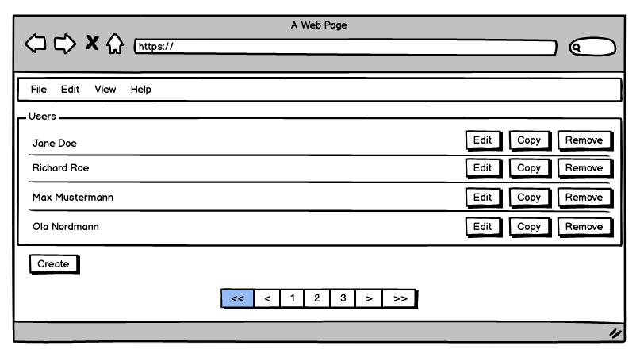

Activity/Technique: *User Interface Mocking*
------------------------
also known as: Wireframing


### Context
The need for a new service can arise from different occasions: For example, you're building a new single page web app or adding new features to a mobile app. If the service client does not exist yet, how do you know what responsibilities your service should have, and what message structure is best suited for the service client? 

### Goal and Purpose (When to Use)
A general purpose is to present emerging user interface designs with stakeholders (for instance, end users and product managers)to solicit their feedback and involve them in the design closely. The goal of *User Interface Mocking* or *Wireframing* in the context of service design is to get a better understanding of the structure, amount and kind of data a client needs so that the service can be designed accordingly.
For example, should a service use [Pagination](https://www.microservice-api-patterns.org/patterns/structure/compositeRepresentations/Pagination) to break response messages into chunks, and what kind of [Reference Management](https://www.microservice-api-patterns.org/patterns/quality/#reference-management/) is best suited? 

*When not to use*. Services and APIs serve different purposes. Some are tailored to a specific frontend (so-called [Backends-for-frontend](https://samnewman.io/patterns/architectural/bff/) pattern), while others are built for a yet unknown client (i.e., when your product offering is the API itself). If you're not planning on also creating a client for the service, then doing a mock-up of its interface might not be the best approach and you might be better served by [Stepwise Service Design](DPR-StepwiseServiceDesign) instead.

### Instructions (Synopsis, Definition)
The fidelity of user interfaces mockups varies between hand-drawn sketches to pixel perfect, clickable prototypes. A middle way of a rough grayscale layout (to make clear that this is just a mockup and should not be taken as representing the exact outcome) that shows the UI elements and approximate position offers a good cost-benefit ratio.

According to [Balsamiq's Five Steps to Creating Great Wireframes](https://balsamiq.com/learn/articles/five-steps-to-great-wireframes/), creating a wireframe comprises five steps: 

1. *Articulate* the scenario you're addressing. Input for this comes from [User Stories](../artifact-templates/DPR-UserStory) and [Use Cases](../artifact-templates/DPR-UseCase).
1. *Generate* a first mock up, and
1. *Iterate* until you have a few variations for each screen.
1. *Communicate* your results to your team and
1. *Validate* that it actually solves the problem you set out to solve.

The resulting wireframes support [Stepwise Service Design](DPR-StepwiseServiceDesign) from requirements gathering to decomposition. For instance, the first mockup can be used to populate the [Candidate Endpoint List](../artifact-templates/SDPR-CandidateEndpointList.md). A regular alignment of wireframes and the API design, expressed in the [Refined Endpoint List](../artifact-templates/SDPR-RefinedEndpointList.md) and the [API description a.k.a. service contract artifact](../artifact-templates/SDPR-APIDescription.md), can reduce the risk that the API needs to be reworked for the development of the frontend during Step 7 (API design evolution).
 

### Example(s)

The following wireframe shows a rather simple and basic screen for user management. But it still contains some valuable information for our service design:

* Users can be created, edited and removed. This hints at role of our service: it's probably an [Information Holder](https://www.microservice-api-patterns.org/patterns/responsibility/endpointRoles/InformationHolderResource).
* Users can be copied. This might be relevant for our service, but it could maybe also be implemented just on the client side.
* The navigation elements at the bottom of the page suggest that there will be a large number of users and that they can be [navigated in pages](https://www.microservice-api-patterns.org/patterns/structure/compositeRepresentations/Pagination). 



### Benefits vs. Effort (Expected Benefits, Skill Levels)
Creating some sort of mock up (whether that's a paper prototype or fully interactive design) is part of most teams workflow anyway, but it's usually done to communicate between designers, developers and customers/end-users and not for service design.


### Hints and Pitfalls to Avoid
Take care not to loose yourself in details, so don't use a graphics program that lets you create a pixel-perfect design, but keep it rough, just like in the example above. Besides saving time and allowing to focus on the task at hand, figuring out the coarse-grained layout and content of your screens; this also clearly communicates to the other stakeholders that you're still far from a working application.


### Origins and Signs of Use
Similar techniques probably have been around since the very beginning of software design. 

Mocks should be easy to spot if the above advice to keep it rough is followed; those created with tools, might be hard to distinguish from actual, fully implemented user interfaces and raise unjustified "done" impressions and expectations. 


### Related Content
Input for your design will come from [User Stories](../artifact-templates/DPR-UserStory.md) and [Use Cases](../artifact-templates/DPR-UseCase.md).


#### Performing Roles and Related Artifacts (Synopsis)
Typically user experience specialist, designer, developer; anyone can do it!

<!--
|**Role**| Input | Output | Comments |
|:-|:-----:|:------:|:--------:|
|  |  |  |  |
-->


#### Practices and Techniques (Refinements, Guides)
User interface mocks can be done with pen and paper and of course with any general purpose graphics software. Specialized tools also exist, here's a non-exhaustive list:

* [Adobe XD](https://www.adobe.com/products/xd.html)
* [Balsamiq Wireframes](https://balsamiq.com/) (used for the example above)
* [Figma](https://www.figma.com/)
* [Miro](https://miro.com)
* [Sketch](https://www.sketch.com/)


### More Information 
See [this user interface design intro](https://balsamiq.com/learn/courses/intro-to-ui-design/) course for a starting point.


### Data Provenance 

```yaml
title: "Design Practice Repository (DPR): Practice/Technique User Interface Mocking"
author: Mirko Stocker (STX)
date: "08, 15, 2020 (Source: Project DD-DSE)"
copyright: Olaf Zimmermann, 2020 (unless noted otherwise). All rights reserved.
license: Creative Commons Attribution 4.0 International License
```

