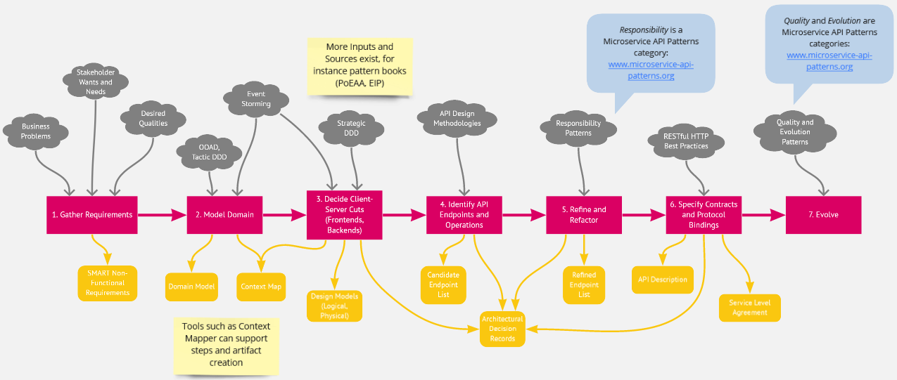
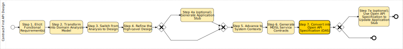
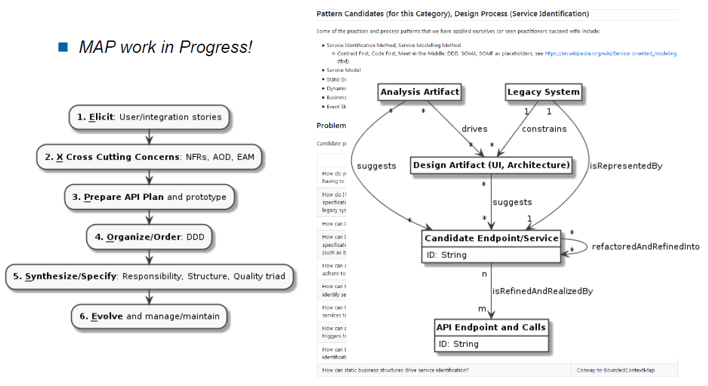
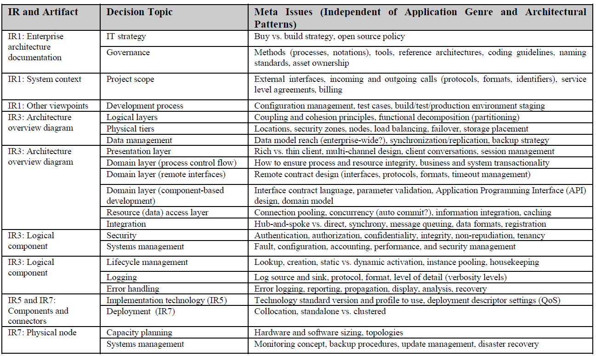

Activity: *Stepwise Service Design*
-------------------------------------
a.k.a. Contract-First, Incremental/Top-Down Service Identification, Iterative API Design and Refinement, Evolutionary Integration Architecting <!-- "eiSD"? -->


### Context
The [Microservice API Patterns (MAP)](https://microservice-api-patterns.org/) website motivates the need for Application Programming Interface (API) and (micro-)service design as this: 

"While much has been said about microservices in general and about supporting infrastructure architectures, the actual service design has received less attention:

* *How many services should be exposed? What is an adequate size for them?*
* *How to ensure that services are loosely coupled? How much data should they exchange, and how often does this happen?*
* *What are the most suitable message representations? How to agree on the meaning of each message?*"

API and service design have high [architectural significance](https://en.wikipedia.org/wiki/Architecturally_significant_requirements), but also have to be implemented, obviously. Hence software [architects](/roles/DPR-ApplicationArchitects.md) and developers collaborate on this activity; [API owners](/roles/SDPR-APIProductOwner) initiate and oversee this work.


### Goal and Purpose (When to Use and When not to Use)
This activity has the objective to answer the questions raised under 'Context' above. It delivers:

1. Platform-independent *interface specifications*, including service contract and service level agreement.
2. At least one serialization *technology mapping* and communication *protocol binding* for this design (for instance, JSON schemas and HTTP resource contracts). 

This activity includes [domain-driven design](./DPR-TacticDDD.md); other forms of business-driven forward engineering can be used alternatively. It is commonly used when [backend integrations](https://microservice-api-patterns.org/patterns/foundation/BackendIntegration) are realized. It can also be applied in [frontend integration](https://microservice-api-patterns.org/patterns/foundation/FrontendIntegration); in that case, [User Interface Mocking](./DPR-UserInterfaceMocking.md) is an alternative and complementary activity. 


### Instructions (Synopsis, Definition)

There is no single path to APIs and service endpoints of quality and style. When "surfing" the Web to search for recommendations and guidelines regarding API design and (micro-)service size, or asking the elders how they do it, one "rides" at least seven "waves" of analysis and design work:  

<!-- Source: https://miro.com/app/embed/o9J_ko6VkCM=/? -->

<!-- not possible: HTML inlining/embedding as offered by miro: 
<iframe width="640" height="360" src="https://miro.com/app/embed/o9J_ko6VkCM=/?" frameborder="0" scrolling="no" allowfullscreen></iframe>
-->

1. *Understand the business problem as well as stakeholder wants and needs, including desired system qualities.* Before anything can be designed, we ought to know: what should be done (on the project, by the software), and how? Many workshop techniques supporting this step exist, for instance (to name just two) [event storming](https://www.eventstorming.com/) and [quality storming](https://speakerdeck.com/mploed/quality-storming). No matter which technique or template is used, the Non-Functional Requirements (NFRs) should be elicited in a [SMART](DPR-SMART-NFR-Elicitation.md), value- and risk-driven way.
2. *Model the business domain and group related capabilities*, for instance by applying [tactic Domain-Driven Design (DDD)](DPR-TacticDDD.md) and [strategic DDD](DPR-StrategicDDD.md) (Vernon:2013). If "buy" or "rent" is an option (rather than "build" from scratch only), reverse engineer the interfaces and domain models of the existing systems to be bought or rented and integrated.
3. *Split applications into frontends and backends*, again applying [strategic DDD](DPR-StrategicDDD.md) and/or other patterns for distributed computing while doing so (@Buschmann:2007, @RenzelKeller:1997). While designing, *capture the [architectural decisions](DPR-ArchitecturalDecisionCapturing.md) made* and *[model](DPR-ArchitectureModeling.md) the resulting architecture*.
4. *Create a [Candidate Endpoint List](../artifact-templates/SDPR-CandidateEndpointList.md)* that identifies potential API resources and their roles. For each candidate endpoint, *foresee a [Remote Facade](https://martinfowler.com/eaaCatalog/remoteFacade.html) that exposes [Data Transfer Objects (DTOs)](https://martinfowler.com/eaaCatalog/dataTransferObject.html)* in its request and response messages of the API operations) and assemble these facades into one or more [Service Layers](https://martinfowler.com/eaaCatalog/serviceLayer.html) to decouple the languages of frontends and backends (@Fowler:2002). Keep on deciding and capturing your architectural decisions. 
5. *Define operation responsibilities and data formats to yield a [Refined Endpoint List](../artifact-templates/SDPR-RefinedEndpointList.md)* and *map the candidate endpoints to existing or new API providers*. If needed, *decompose monolithic backends into (micro-)services* (@Newman:2015) to promote flexibility and scalability if these are desired qualities and your software engineering (and operations) toolbox is rich and mature enough. [*Refactor*](https://www.ifs.hsr.ch/Architectural-Refactoring-for.12044.0.html?&L=4) (@Zimmermann:2017) the preliminary architecture from the previous steps along the way (including the remote facades and DTOs). Document and justify these architectural decisions too. 
6. Once the entries in the refined endpoint list are somewhat stable, *decide for integration technologies* (protocols such as plain HTTP, GraphQL or gRPC, message exchange formats such as JSON and XML) and implement stubs (or an minimum viable API product), integrate and test. *Specify service contracts including protocol bindings and technology mappings* in an [API description a.k.a. service contract artifact](../artifact-templates/SDPR-APIDescription.md). Optionally, add [Service Level Agreements](../artifact-templates/SDPR-ServiceLevelAgreement.md) and [Rate Plans](https://microservice-api-patterns.org/patterns/quality/qualityManagementAndGovernance/RatePlan). Decide on service deployment technologies and microservice infrastructure middleware such as [API gateways](https://microservices.io/patterns/apigateway.html), load balancers, container orchestration engines and cloud offerings (@Fehling:2014), again capturing your decision outcome (for instance, in the code or in Markdown architectural decision records).
7. *Improve and evolve the API design* and its implementation, for instance adjust endpoint and operation numbers as well as request and response message structures to meet the desired runtime qualities (for instance, performance and scalability). Apply [(micro-)service API design and evolution patterns](https://microservice-api-patterns.org/patterns/evolution/) along the way (@Daigneau:2011, @Zimmermann:2020).

The seven-step sequence does not suggest sequential or one-time execution ("BDUF"). Whenever you learn something new in later steps, you can return to previous ones; whenever you believe you need to jump ahead to learn more about the technologies, existing systems, etc., you can and should do so. 
In this DPR repository, the seven top-level steps and activities are supported by one or more [*artifact templates*](../artifact-templates): 

1. Functional requirements are often specified and communicated as [user stories](../artifact-templates/DPR-UserStory.md) and/or [use cases](../artifact-templates/DPR-UseCase.md). 
2. [Domain Models](../artifact-templates/DPR-DomainModel.md) on different levels of elaboration and refinement capture the results of Object-Oriented Analysis and Design (OOAD) in general and [tactic DDD](DPR-TacticDDD.md) in particular; [Context Maps](../artifact-templates/DPR-StrategicDDDContextMap.md) result from [Strategic DDD](DPR-StrategicDDD.md).
3. Many templates exist for [Architectural Decision Capturing](DPR-ArchitecturalDecisionCapturing.md), which has emerged from an unwelcome but important side activity to a full-fledged practice. DPR includes [Y-statements](../artifact-templates/DPR-ArchitecturalDecisionRecordYForm.md). Many options for visualizing/diagramming architectures exist; DPR lists a few practices, notations and tools (and opinions) in its [Architecture Modeling](DPR-ArchitectureModeling.md)activity description. <!-- TODO (v2) mention EAM FWs such as TOGAF -->
4. The [Candidate Endpoint List](../artifact-templates/SDPR-CandidateEndpointList.md) in DPR balances flexibility and expressivity. <!-- Online articles, for instance by [Mike Amundsen](https://www.infoq.com/articles/web-api-design-methodology/), and an [e-book by Phil Sturgeon](https://apisyouwonthate.com/books/build-apis-you-wont-hate) provide pragmatic and tangible advice for this step. -->  
5. The [Refined Endpoint List](../artifact-templates/SDPR-RefinedEndpointList.md) then is more precise and assertive. It can specify endpoint roles and operation responsibilities, data formats and media types as well as provider implementation candidates and decisions. 
6. Step 6 from above should be "business as usual" for agile full stack developers and integration specialists for the most part, yielding an expressive, understandable [API description a.k.a. service contract artifact](../artifact-templates/SDPR-APIDescription.md). Both the abstract "port" level as well as technology-specific "adapter" bindings should be covered in it; both business and technical information has to be published in it. <!-- TODO (v2) write about "API TDD", jUnit, Postman, SOAPUI, Swagger tools, etc.; bring in review checklist from @Lauret:2019 (can also go to Step 7) -->
7. Patterns from two categories in [Microservice API Patterns (MAP)](https://microservice-api-patterns.org/) are eligible here, the [quality category](https://microservice-api-patterns.org/patterns/quality/) and the [evolution category](https://microservice-api-patterns.org/patterns/evolution/). 

All artifacts can be drafted, revised and completed iteratively and incrementally.

<!-- 
The architectural refactoring activity is not documented in DPR (this repository) yet, but introduced [here (overview)](https://www.infoq.com/articles/architectural-refactoring/) and [here (more elaborate version with a draft catalog)](http://www.2015.summersoc.eu/wp-content/uploads/2015/07/2.4.ZIO-SummerSoC2015-ArcRefCloudv10p.pdf); it can be supported by tools such as [Context Mapper](https://contextmapper.org/docs/architectural-refactorings/) and [Service Cutter](https://contextmapper.org/docs/service-cutter-context-map-suggestions/).

TODO feature API testing too? 

* https://dzone.com/articles/api-testing-and-automation-101-the-essential-guide 
* https://techbeacon.com/app-dev-testing/11-top-open-source-api-testing-tools-what-your-team-needs-know 
* https://www.guru99.com/top-6-api-testing-tool.html 

-->


### Example(s)
Our [tutorial 1](../tutorials/DPR-Tutorial1.md) applies the seven steps to an online shop example (work in progress). 

In a [demo for tool-supported API design and service identification](https://ozimmer.ch/practices/2020/06/10/ICWEKeynoteAndDemo.html), the seven steps are applied, and partially automated with the help of [Context Mapper](https://contextmapper.org/news/2020/08/06/v5.15.0-released/) and [MDSL](https://microservice-api-patterns.github.io/MDSL-Specification/) tools such as an Open API generator: 



Finally, the microservices in the sample application [Lakeside Mutual](https://github.com/Microservice-API-Patterns/LakesideMutual) contain several Service Layers that expose Remote Facades implemented as HTTP resources and DTOs that are serialized into JSON.

<!-- 
https://www.bpmn-sketch-miner.ai/# 

Contract-First API Design:

Step 1. Elicit Functional Requirement(s)
Step 2. Transform into Domain Analysis Model
Step 3. Switch from Analysis to Design
Step 4. Refine the High-Level Design
Step 4a (optional). Generate Application Stub
Step 5. Advance to System Contexts
Step 6. Generate MDSL Service Contracts
Step 7. Convert into Open API Specification (OAS)
Step 7a (optional). Use Open API Specification to Update Application Stub
-->

See [MAP tutorial 2](https://microservice-api-patterns.org/patterns/tutorials/tutorial2) for an additional application example.


### Benefits vs. Effort (Expected Benefits, Skill Levels)
The more clients an API has and the longer it runs and the more mission-critical it is, the more it pays off to invest in contract-first API and service design. 


### Hints and Pitfalls to Avoid

* *Do not follow the steps sequentially* but iterate, refactor, evolve stepwise. Iterate, refactor, evolve again. Iterate, refactor, evolve continuously. The logical ordering of the seven steps by no means implies waterfall or [Big Design Up Front (BDUF)](https://en.wikipedia.org/wiki/Big_Design_Up_Front). 
* *Avoid &mdash; or spot and overcome &mdash; [analysis paralysis](https://en.wikipedia.org/wiki/Analysis_paralysis)*. Acknowledge the general rules of method engineering, including:
> 1. If in doubt, leave it out, 2. Do not follow templates blindly, but adopt them to your needs, 3. Context matters. <!-- source: readmes for activities, artifacts, roles -->
* *Apply patterns* to optimize API qualities when evolving it. For instance, do not over-fetch and do not under-fetch; adding [Pagination](https://microservice-api-patterns.org/patterns/structure/compositeRepresentations/Pagination) or [Wish Lists](https://microservice-api-patterns.org/patterns/quality/dataTransferParsimony/WishList) to an API operation signature slices the response payload and allows clients to specify what data they need (and yes, GraphQL has this design goal too).
* Respect technology- and platform-specific design guidelines, for instance those in the "RESTful Web Services Cookbook" (@Allamaraju:2010).


### Origins and Signs of Use
If OpenAPI specifications are provided, either contract-first or code-first API design has been practiced. Usage of domain-driven design patterns such as *Published Language* also may indicate use.

The DDD DSL tool Context Mapper supports some of the steps with its [model transformations](https://contextmapper.org/docs/rapid-ooad/), [architectural refactorings](https://contextmapper.org/docs/architectural-refactorings/) and [service contract generation](https://contextmapper.org/docs/mdsl/).


### Related Content

#### Performing Roles and Related Artifacts (Synopsis)
See metadata at the top for performing roles. 

<!--
|**Role**| Input | Output | Comments |
|:-|:-----:|:------:|:--------:|
|  |  |  |  |
-->

Produced artifacts: 

* [Candidate Endpoint List](../artifact-templates/SDPR-CandidateEndpointList.md) and [Refined Endpoint List](../artifact-templates/SDPR-RefinedEndpointList.md)
* [API Description](../artifact-templates/SDPR-APIDescription.md) a.k.a. Service Contract
* [Service Level Agreement](../artifact-templates/SDPR-APIDescription.md)
* Decision log of [Y-statements](../artifact-templates/DPR-ArchitecturalDecisionRecordYForm.md) 
* Architectural models (different viewpoints)


#### Other Practices (Alternatives)
Early presentations on MAP featured six steps called EXPOSE:
<!-- (see [this conference presentation]() 2018 seminar preso): --> 



Sometimes, a bottom-up approach exposing already existing [solution-internal APIs](https://microservice-api-patterns.org/patterns/foundation/SolutionInternalAPI) is preferred, in particular when only a few straightforward API calls are required: standardized or framework-specific annotations (or other forms of configuration) call our services, operations and parameters (and map them to JSON and Web server settings). Such code-first approach is supported well, for instance in Web Frameworks; it runs the risk of not meeting API client requirements and violating API design best practices (unless a dedicated [Service Layer](https://martinfowler.com/eaaCatalog/serviceLayer.html) is included in the architecture to decouple application and domain logic from integration and interface code).

Bottom-up *code-first* API design can be combined with this top-down contract-first design activity to yield a *meet-in-the-middle* approach (note that code-first runs the risk of exposing provider-side implementation details in the API contract, which violates the information hiding principle).


### More Information 

While written with the Web and RESTful HTTP in mind, many of the existing informal "methods" (or design heuristics) can also be applied when other technologies are chosen:

* Arnaud Lauret, "The Design of Web APIs" (@Lauret:2019).
* Phil Sturgeon's website and e-books themed [APIs you won't hate](https://apisyouwonthate.com/).
* Presentations, [blog posts](http://amundsen.com/blog/) and [books](https://www.amazon.com/Design-Build-Great-Web-APIs/dp/1680506803) by Mike Amundsen.

<!-- The [API Academy](https://apiacademy.co/) "provides expertise and best practices for the strategy, architecture, design and security of enterprise-grade APIs and microservices". -->

The [quality patterns tutorial in MAP](https://www.microservice-api-patterns.org/patterns/tutorials/tutorial1) explains which kind of quality issues patterns such as *Wish List* can mitigate. <!--  Even if you are not yet thinking about the next version of your API, it is good to know which evolution strategies and patterns exist. -->

The SOAD project 2006 to 2009 compiled a number of architectural decisions that are required when designing service-oriented architectures. Being independent of application genre and architectural style, the meta issues in Table 2 from the SOAD paper ["Architectural Decision Identification in Architectural Patterns"](https://soadecisions.org/download/SOAD-SHARK2012v13Final.pdf) can guide the decision making in Steps 3 to 7:



Note that in microservices architectures, more options for these decisions (in transition from meta issues to actual decisions required) are available, and the decision drivers may vary too. See [this blog post](https://ozimmer.ch/patterns/2020/07/06/MicroservicePositions.html) and [this article](http://rdcu.be/mJPz) for more information on microservices as an implementation approach to service-oriented architectures.

<!-- TODO (v2.1) https://www.slideshare.net/launchany/gluecon-2019-beyond-rest-moving-to-eventbased-apis-and-streaming?next_slideshow=1 -->


### Data Provenance 

```yaml
title: "Design Practice Repository (DPR): Stepwise Service Design"
author: Olaf Zimmermann (ZIO)
date: "10, 16, 2020 (Source: Project DD-DSE)"
copyright: Olaf Zimmermann, 2020 (unless noted otherwise). All rights reserved.
license: Creative Commons Attribution 4.0 International License
```
