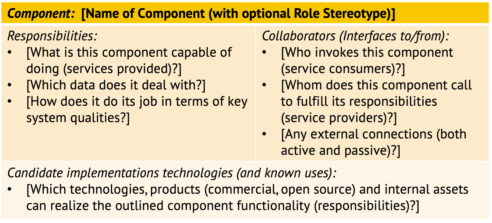

Artifact/Template: *Components, Responsibilities, Collaborators (CRC) Card*
---------------------------------------------------------------------------
<!--Alternate names or candidate names) can be listed as "Also known as " here.-->

### Motivation (Addressed Information Need) 
*How can logical design building blocks be described on an intermediate level of detail and refinement?*

A notation that is well suited for *candidate* component modeling is the *CRC Card* format. CRC stands for Components, Responsibilities, Collaborators (CRC) here; you also find Classes or Candidates as the meaning of the first 'C'. CRC cards finds a balance between being precise and being consumable; code interfaces would be too detailed, boxes-and-arrows diagrams to abstract.


### Usage (Produced and Consumed When)
<!--AA/AS/AE, must identify the producing role and the target audience-->

One usage scenario for CRC cards is as a workshop or "design thinking" element, sometimes involving a role-playing game: Each participant takes the role of an object/a candidate component (one CRC card). A ball representing control flow is thrown around to specify data flow, (a)synchrony, etc. The resulting collaborations and responsibilities are recorded on CRC card. 

Another usage scenario is specification and documentation tool. Finally, the cards can support decision making during component realization, starting with the "buy vs. build" decision: 

* Buy, build, or rent (a cloud service)?
* Use software package, commercial middleware, or open source software? 
* Can an operating system feature fulfill the responsibilities (such as crontab as a job scheduler)?  


### Template Structure and Notation(s)

An annotated template (with teaser questions) is:


<!-- 
 -->

### Example(s)

This is an example of a filled out card (an entire layer is described here, rather than a single component in that layer):


<!-- 

-->

### Tools
<!--From AA, should call out what one needs to be able to do on beginner, intermediate, advanced level; as a team -->
Any tool that support table layouts (preferably with the option to merge cells) can be used. Online and offline whiteboards will do too. Wikis and Markdown tables are additional options.


### Hints and Pitfalls to Avoid (Common Pitfalls)

CRC cards must be expressive, but also easy to understand:

* Names should communicate what application/architecture are about
    * Metaphors are good, but must be chosen wisely. How will key stakeholders react to them?
    * Prefer strong semantics and domain-specific vocabulary, e.g. "Web Shop" over "Client".
    * A common naming scheme is `domain concept + architectural role/pattern`.
* Value consistency (no contradictions) over completeness
    * Good component descriptions should be SMART (like goals and NFRs)
    * Each outgoing collaboration relationship should correspond to an incoming one elsewhere in system or its context (service consumer and provider).
    * Sunny day (happy path scenarios) and rainy days (error and edge cases) should be taken into account when assigning responsibilities.
* Model on same level of detail on all cards and find a medium ground:
    * Too precise specifications are hard to implement and change 
    * Too vague ones do not add value, implementations are hard to integrate, and the resulting architecture is difficult to validate.


### Origins and Signs of Use
<!-- From PLOPs and from AA-->
The original CRC cards were invented by W. Cunningham, who also invented Wikis and Technical Debt metaphor, and published in his [OOPSLA 1989 paper](http://c2.com/doc/oopsla89/paper.html). They were used for object design and popularized in the Responsibility-Driven Design (RDD) method (@WirfsBrock:RDD:2002). 

On the architectural level, they are used in Volume 1 of the POSA book series (@Buschmann:1996). See this [blog post by M. Stal](http://stal.blogspot.ch/2006/12/architects-toolset-crc-cards.html) for background information and rationale. [O. Zimmermann](https://www.ifs.hsr.ch/Olaf-Zimmermann.11623.0.html?&L=4) has been using them this way in his "Application Architecture" lecture at HSR/OST since 2013; M. Keeling features them as Activity 13 in "Design It!" (@Keeling:2019).

Usage is straightforward to spot; just look for the keywords "responsibilities" and "collaborations" (or "collaborators") and a table format that resembles the one introduced above (the section on candidate implementation technologies and known uses is optional). <!-- added by ZIO -->


### Related Artifacts and Practices (incl. Alternatives)
<!--in DPR/OLAF and elsewhere-->

Notes and comments in UML tools (and Structurizr) as well as plain text descriptions can be used alternatively.  

Interface-Responsibility-Interactions (IRI) cards are a similar concept, but applied to interfaces @Pugh:2006.


### More Information
The [RDD tutorial](http://www.wirfs-brock.com/PDFs/A_Brief-Tour-of-RDD.pdf) explains the *original*, class-level version and provides additional examples.

G. Hohpe explains the difference between "scope" and "abstraction" in his blog post ["The Architect’s Path (Part 1 - Model)"](https://architectelevator.com/architecture/architect-path/). CRC cards have a narrow scope and a conceptual level of abstraction (bottom right quadrant).

RDD and many other methods are compiled in the story ["Driven by Acronyms"](https://medium.com/olzzio/driven-by-acronyms-e1568b73e4aa) on Medium.


### Data Provenance 

```yaml
title: "Design Practice Repository (DPR): CRC Card"
author: Olaf Zimmermann (ZIO)
date: "12, 04, 2020"
copyright: Olaf Zimmermann, 2020 (unless noted otherwise). All rights reserved.
license: Creative Commons Attribution 4.0 International License
```

<!--
# References
[C-99]: # (Comment: References will be added here automatically when using -bibliography option of pandoc command)
-->