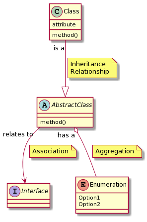
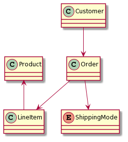
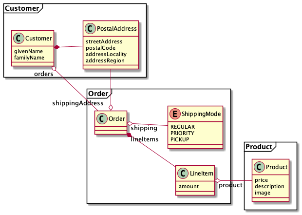

Artifact/Template: *Domain Model*
---------------------------------

### Motivation (Addressed Information Need) 
A domain model shows the essential/most important/core business concepts of an application and how these concepts relate to each other. A domain model helps domain experts (a.k.a. business analysts), architects, developers and all other project stakeholders to establish (and agree on) a common understanding of the business problem domain, which is an important milestone en route to an appropriate service design.

In the context of [stepwise API and service design](../activities/SDPR-StepwiseServiceDesign.md), a domain model is instrumental to identify [candidate endpoints](SDPR-CandidateEndpointList.md) for the provider-side service layer. 


### Usage (Produced and Consumed When)
Depending on the maturity of the design and the phase/stage of the project, domain models can be very minimal and only feature business concepts as classes and relationships. More elaborate domain models might include behavior in the form of method names or even complete method signatures and data attributes, domain events and business rules (constraints, invariants).

Domain models are usually created early in the project and are refined continuously throughout the project. 


### Template Structure and Notation(s)
Martin Fowler distinguishes between simple domain models, that "look very much like the database design" and rich domain models, which use "inheritance, strategies, and other @Gamma:1995 patterns, and complex webs of small interconnected objects" (in @Fowler:2002). 

UML class diagrams are the most commonly used notation for domain models. Keep in mind that a domain model does not need to specify every detail of the resulting implementation, but should show the most important concepts and give the reader an understanding of the code. 




### Example(s)
A minimal domain model can start with just the classes and their relations. For example, here's a very simple domain model for an e-commerce site:



This can then be fleshed out with more details, for example more specific relations, attributes and methods:



In a next step, the method names could be turned into full method signatures with fully typed parameter names and return values.

### Tools
Pen and paper or a whiteboard are enough to get started on a simple model. The examples above were generated using [PlantUML](https://plantuml.com/class-diagram), a textual DSL for various kinds of diagrams.

[Context Mapper](https://contextmapper.org/docs/tactic-ddd/), a DSL and tool for strategic and tactic DDD, embeds Sculptor. The Sculptor DSL can express domain models. UML profiles exist as well.


### Hints and Pitfalls to Avoid

* A domain model is not a data-centric entity-relationship (ER) diagram, even if these two artifacts might look very similar at the first glance. For instance, the domain model for example does not contain any notion of primary keys, whereas the typical ER diagram does not use inheritance. Domain models are supposed to feature attributes *and* operations. Martin Fowler warns about such [Anemic Domain Models](https://www.martinfowler.com/bliki/AnemicDomainModel.html) in his bliki.
* A domain model can serve as an early check to see whether the desired functionality can be implemented, e.g. by making sure that all required relationships are present.
* The refinement of the domain model as more use cases/user stories are implemented and the design evolves should not be forgotten (but often is).


### Origins and Signs of Use
When UML-based methods and their predecessors are applied, chances are that a domain model is present:

* "UML Components" by Cheesman/Daniels has a *business type model* artifact (which is an early OOA Domain Model)
* Larman's book on UML and patterns covers OOA and OOD. 
* Tactic DDD can be seen as domain modeling "on stereoids".


### Related Artifacts and Practices (incl. Alternatives)
* E/R diagrams from Structured Analysis (SA) can be used alternatively.
* Informal glossaries of the project's ubiquitous language can feed the domain model, or be extracted from it.
* Code-level class diagrams might use the same notation, but have a different purpose. 


### More Information
While often associated with object oriented languages, domain modeling can also be used in functional programming languages. See Debasish Ghosh's [Functional and Reactive Domain Modeling](https://www.manning.com/books/functional-and-reactive-domain-modeling). 


### Data Provenance 

```yaml
title: "Design Practice Repository (DPR): Domain Model"
author: Mirko Stocker (STX), Olaf Zimmermann (ZIO)
date: "08, 14, 2020 (Source: Project DD-DSE)"
copyright: Olaf Zimmermann, 2020 (unless noted otherwise). All rights reserved.
license: Creative Commons Attribution 4.0 International License
```
