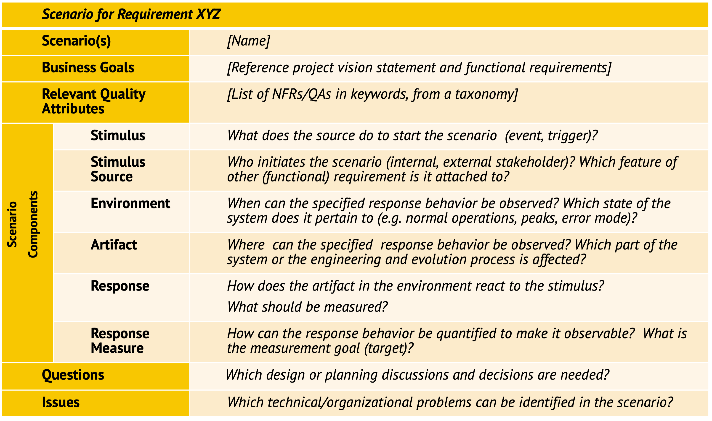
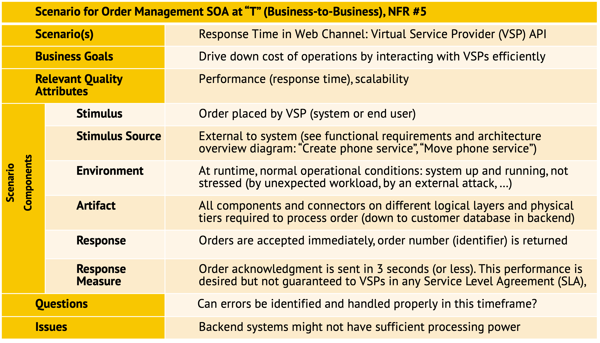

[DPR Git Pages Home](https://socadk.github.io/design-practice-repository) ---
[Artifacts Index](https://socadk.github.io/design-practice-repository/artifact-templates)

Artifact/Template: *Quality Attribute Scenario (QAS)*
-----------------------------------------------------
also known as: SMART Non-Functional Requirement (NFR) Specification

> *A quality attribute scenario specifies a measurable quality goal for a particular context.*

There might be multiple goals and corresponding scenarios, even when dealing with a single quality in a single context.

### Motivation (Addressed Information Need) 

It is not sufficient to find out and specify *what* a system under construction is supposed to do. It is equally important to investigate *how* it does so (from an architectural point of view). Vague statements such as "we value a splendid user experience" or "the faster, the better" are not verifiable and lead to tension between the project team and its external stakeholders.


### Usage (Produced and Consumed When)

QAS are created, refined, and used in:

* Requirements elicitation (analysis), see [SMART NFR Elicitation](../activities/DPR-SMART-NFR-Elicitation.md) activity
* Architecture design and architectural decision making
* Test preparation and testing (stress testing in particular)
* Establishment of [Service Level Agreement (SLA)](SDPR-ServiceLevelAgreement.md) 
* Reviews and planning of re-engineering and refactoring


### Template Structure and Notation(s)

The full template look as follows (with explanations). Note that the six rows in the middle, from "Stimulus" to "Response Measure", which are grouped as "Scenario Components", form the core of a QAS. The other ones provide context information and deal with consequences of the specified response and response measure.



See the [sample chapter of ADD 3.0 book](https://ptgmedia.pearsoncmg.com/images/9780134390789/samplepages/9780134390789.pdf) by Humberto Cervantes and Rick Kazman @Cervantes:2016 for the SEI visualization.
<!-- TODO (v2) (M) repaint and show graphical image from SEI books and reports (MK has them too), https://ptgmedia.pearsoncmg.com/images/9780134390789/samplepages/9780134390789.pdf bibtex this tutorial is good too: https://resources.sei.cmu.edu/library/asset-view.cfm?assetid=436536 (SATURN 2015) -->

### Example(s)




### Tools

This is a text artifact, possibly structured with the help of templates and tables. Any word processing or other tool supporting item lists and table formatting can be used to create QAS instances, including wikis, markup languages, and Markdown.

Requirements management tools provide additional tooling options.

### Hints and Pitfalls to Avoid (Common Pitfalls)

* Focus on key qualities, prioritize elicitation and documentation effort by business value and technical risk (for instance, via a test for [architectural significance](https://medium.com/olzzio/architectural-significance-test-9ff17a9b4490)).
* Define the desired behavior in different environments such as steady state, high workload, and error cases. Create multiple QAS instances as/if needed.
* Do not let the scope of this analysis artifact creep, for instance, by morphing it into a design document. The response measure is an observable quality, not a means to achieve this quality.

<!-- TODO could talk about design time vs. runtime; what are measures for design time qualities such as maintainability? could talk about quality trees for prioritization, risk-based approach by M. Glinz -->


### Origins and Signs of Use

<!-- UML-based methods and their predecessors: -->

* The SEI books and technical reports established the template since the late 1990s (@Bass:2012).
* The arc42 template also features it in its [Section 10](https://docs.arc42.org/section-10/).
* Methods such as the Unified Process have/had similar concepts.


### Related Artifacts and Practices (incl. Alternatives)

Relate activities in DPR are:

* [SMART NFR Elicitation](../activities/DPR-SMART-NFR-Elicitation.md) features "specific" and "measurable" as quality criteria for quality requirements; QAS satisfy these properties when filled out properly.
* The [Architecture Modeling](../activities/DPR-ArchitectureModeling.md) activity uses QAS (or other forms of SMART NFRs) as input.

Many artifacts require specific and measurable NFRs as input, including but not limited to Architectural Decision Records (ADRs) and [Deployment Diagrams](DPR-DeploymentDiagram.md).


### More Information

Related concepts include: 

* [Agile landing zones](https://wirfs-brock.com/blog/2011/07/21/introducing-landing-zones/) for NFRs 
* NFR checklists, for instance, regarding the SMARTness of the quality goals  
* [Planguage](https://www.modernanalyst.com/Resources/Articles/tabid/115/ID/2926/Specifying-Quality-Requirements-With-Planguage.aspx), explained in detail in the article "Rich Requirement Specs: The use of Planguage to clarify requirements" @Gilb:2006. <!-- alternative links: http://www.syque.com/quality_tools/tools/Tools104.htm  and <https://www.geocities.ws/g/i/gillani/SE%272%20Full%20Lectures/ASE%20-%20%20Planguage%20Quantifying%20Quality%20Requirements.pdf> -->
 
The blog post ["Do Software Architectures Meet Extra-Functional or Non-Functional Requirements?"](https://ozimmer.ch/practices/2020/11/19/ExtraExtraReadAllboutIt.html) covers NFRs.


### Data Provenance 

```yaml
title: "Design Practice Repository (DPR): Quality Attribute Scenario"
author: Olaf Zimmermann (ZIO)
date: "08, 30, 2024"
copyright: Olaf Zimmermann, 2023-2024 (unless noted otherwise). All rights reserved.
license: Creative Commons Attribution 4.0 International License
```

<!--
# References
[C-99]: # (Comment: References will be added here automatically when using -bibliography option of pandoc command)
-->