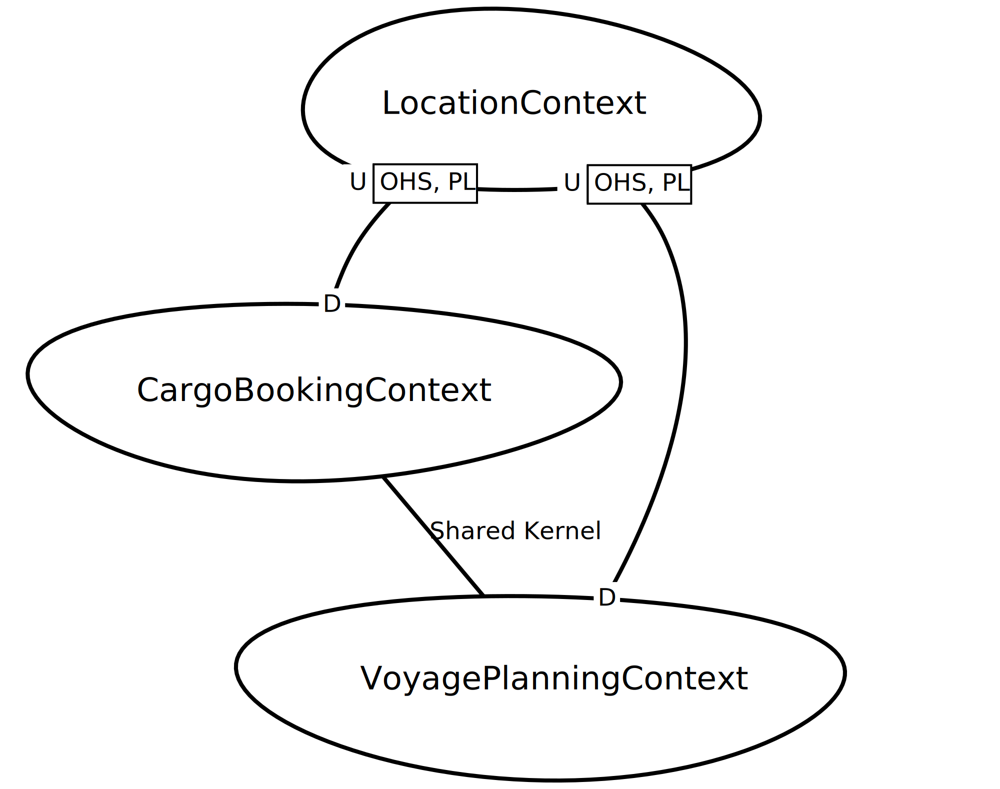

Artifact/Template: Template: *DDD Context Map*
----------------------------------------------

### Motivation (Addressed Information Need)
A context map visualizes the relationships between [Bounded Contexts]() in [Strategic DDD](../activities/DPR-StrategicDDD.md). Several types of such relationships have been described as patterns; Bounded Contexts abstract from functional feature sets, existing or future application or systems as well as teams.

See activity description for [Strategic DDD](../activities/DPR-StrategicDDD.md) for more information (for the time being). 


### Usage (Produced and Consumed When)

* Strategic DDD
* System decomposition 
* Team organization (SAFe, Scrum of Scrums etc.)


### Template Structure
DDD as such does not mandate any notation. Each author and presenter has his/her own style. The following visualization of context maps shown has become quite popular:




### Example(s)

The above context map was generated from this DSL model (Context Mapper):

~~~
ContextMap DDDSampleMap {
	contains CargoBookingContext
	contains VoyagePlanningContext
	contains LocationContext
	
	CargoBookingContext [SK]<->[SK] VoyagePlanningContext
	CargoBookingContext [D]<-[U,OHS,PL] LocationContext

	VoyagePlanningContext [D]<-[U,OHS,PL] LocationContext	
}
~~~


### Tools

* Context Mapper
* Any drawing tool
* Whiteboard


### Hints and Pitfalls to Avoid (Common Pitfalls)

* Comment on the arrow/relationship semantics. 
* Provide a figure legend.
* Keep it simple.


### Origins and Signs of Use

See activity description for [Strategic DDD](../activities/DPR-StrategicDDD.md) for the time being. 


### Related Artifacts and Practices (incl. Alternatives)

* System Context Diagram
* Domain Model 
* C4 models and other representations of architecture overviews and component models.


### More Information

Can be found in the book "Implementing Domain-Driven Design" by V. Vernon.


### Data Provenance 

```yaml
title: "Design Practice Repository (DPR): Context Map (Strategic DDD)"
author: Olaf Zimmermann (ZIO)
date: "08, 15, 2020 (Source: Project DD-DSE)"
copyright: Olaf Zimmermann, 2020 (unless noted otherwise). All rights reserved.
license: Creative Commons Attribution 4.0 International License
```
