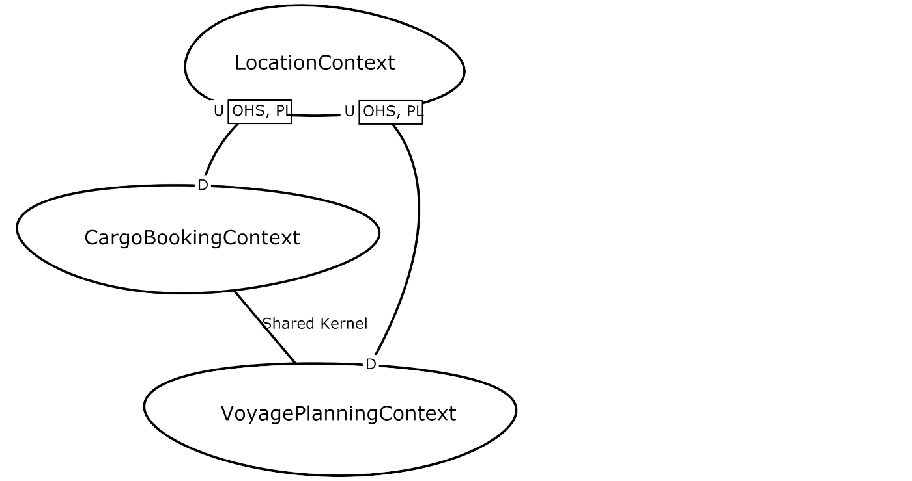

[Git Pages Home](https://socadk.github.io/design-practice-repository)
[Artifacts Overview](https://socadk.github.io/design-practice-repository/artifact-templates)


Artifact/Template: *DDD Context Map*
------------------------------------

> *In domain-driven design, a context map shows bounded contexts (model boundaries, of different types) and their relations (e.g., influence flows).*

### Motivation (Addressed Information Need)
A context map visualizes the relationships between [Bounded Contexts]() in [Strategic DDD](../activities/DPR-StrategicDDD.md). Several types of such relationships have been described as patterns; Bounded Contexts abstract from functional feature sets, existing or future application or systems as well as teams.

See activity description for [Strategic DDD](../activities/DPR-StrategicDDD.md) for more information (for the time being). 


### Usage (Produced and Consumed When)

* Strategic DDD
* System decomposition 
* Team organization (SAFe, Scrum of Scrums etc.)


### Template Structure
DDD as such does not mandate any notation. Each author and presenter has his/her own style. The following visualization of context maps has become quite popular:




### Example(s)

The above context map was generated from this DSL model ([Context Mapper](https://contextmapper.org/)):

```cml
ContextMap DDDSampleMap {
	contains CargoBookingContext
	contains VoyagePlanningContext
	contains LocationContext
	
	CargoBookingContext [SK]<->[SK] VoyagePlanningContext
	CargoBookingContext [D]<-[U,OHS,PL] LocationContext

	VoyagePlanningContext [D]<-[U,OHS,PL] LocationContext	
}
```

### Tools

* [Context Mapper](https://contextmapper.org/)
* Any drawing tool, including online ones
* Whiteboards, both physical and virtual ones such as [miro](https://miro.com)


### Hints and Pitfalls to Avoid

* Decide which type(s) of Bounded Context to support: Feature? Application? System? Team?  
* Specify the arrow/relationship semantics (DDD patterns? other?) and provide a figure legend as DDD does not mandate any particular notation.
* See [Architecture Modeling](../activities/DPR-ArchitectureModeling.md) activity for more modeling hints, including variants of the general "keep it simple" rule.


### Origins and Signs of Use

See activity description of [Strategic DDD](../activities/DPR-StrategicDDD.md) for the time being. 


### Related Artifacts (incl. Alternatives)

* System Context Diagram
* Domain Model 
* C4 models and other representations of architecture overviews and component models.


### More Information

["Strategic Domain Driven Design with Context Mapping "](https://www.infoq.com/articles/ddd-contextmapping/) by A. Brandolini introduces context maps by scenario and example.

Context Maps are covered in depth in the book ["Implementing Domain-Driven Design"](https://www.amazon.com/Implementing-Domain-Driven-Design-Vaughn-Vernon/dp/0321834577) by V. Vernon (@Vernon:2013).

The language reference of the Context Mapper DSL can be found [here](https://contextmapper.org/docs/context-map/) and [this conference presentation](https://contextmapper.org/media/ZIOSK-Modelsward-Paper-Presentation-v101p.pdf) gives an overview.

The Feature, Application, System, Team taxonomy is introduced in ["Domain-driven Architecture Modeling and Rapid Prototyping with Context Mapper,"](https://contextmapper.org/media/978-3-030-67445-8_11_AuthorsCopy.pdf) by S. Kapferer and O. Zimmermann.


### Data Provenance 

```yaml
title: "Design Practice Repository (DPR): Context Map (Strategic DDD)"
author: Olaf Zimmermann (ZIO)
date: "02, 18, 2020 (Source: Project DD-DSE)"
copyright: Olaf Zimmermann, 2020-2021 (unless noted otherwise). All rights reserved.
license: Creative Commons Attribution 4.0 International License
```
