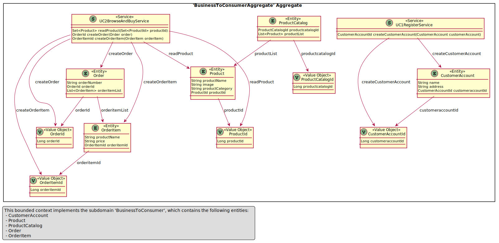
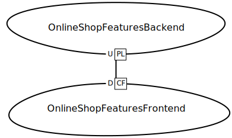

# *DPR* Tutorial 1: API Design in an Online Shop

*Note to reviewers:* This tutorial is not complete yet (work in progress); but hopefully it is helpful already (or can at least give an idea of what is coming).

Let's continue the story from [Quick Start Tutorial 0](DPR-Tutorial0.md) and assume you have been assigned the role of API product owner for a fictitious online shop and its APIs, and decided to use DPR as your architecture design method.


## Featured Activity: Stepwise Service Design 

Let's now walk through the main API design activity in DPR, [Stepwise Service Design](../activities/SDPR-StepwiseServiceDesign.md). Please open the activity page and keep it open while going through the seven steps in the online shop example.  


### Step 1: Gather Requirements, Make Scoping Decisions
<!-- TODO (all steps) summarize purpose, input and output of step from [activity description](activities/SDPR-StepwiseServiceDesign.md)? -->

Two obvious [use cases](../artifact-templates/DPR-UseCase.md) in our sample scenario are specified in a [brief](https://contextmapper.org/docs/user-requirements/) format that unveils the required data and their relations just a bit: 

~~~
UseCase UC1_Register {
    actor = "Online Shopper"
    interactions = create a "CustomerAccount"  
    benefit "shop online and do not have to leave home"
}

UseCase UC2_BrowseAndBuy {
    actor = "Online Shopper"
    interactions = 
      read a "Product" in a "ProductCatalog",
      create an "Order" with its "OrderNumber",  
      create an "OrderItem" in an "Order" 
    benefit "get best price"
}
~~~

<!-- TODO point at artifact descriptions -->

A specific and measurable Non-Functional Requirement (NFR) is: 

* 80% of all executions of "UC1_Register" should produce a correct response (user account created or error reported) in less than 3 seconds on average, measured at the system boundary of the shop (so excluding external network communication).

Scoping decisions might include (in a future version of the tutorial, we'll capture tham as [Y-statements](../artifact-templates/DPR-ArchitecturalDecisionRecordYForm.md)): 

* Build the shop components rather than buy or rent them.
* Use a [microservices architecture](https://microservice-api-patterns.org/introduction) whose service components are identified with [domain-driven design](https://www.ifs.hsr.ch/index.php?id=15666&L=4). 
* Reuse architectural knowledge by applying patterns.
* Develop in JavaScript (frontends) and Java (backends).
* Integrate an external payment service. <!-- TODO feature in SCD etc. -->

Note that these assumptions and decisions merely scope the tutorial; you'll be able to learn about the DPR content without being knowledgeable in any of the technologies and concepts mentioned. 
<!-- [W] "the DPR way" -->


### Step 2: Model Domain, Make/Support Business Decisions
<!-- summarize purpose, input and output of step -->

When analyzing the two use cases from Step 1, the following [tactic DDD](../activities/DPR-TacticDDD.md) pattern instances may capture the analysis results (note that several entity attributes have been added; the Step 1 stories did not mention them explicitly, but justify their introduction implicitly):

<!-- CML source (also appears in models subfolder): 
~~~
Domain ECommerce {
	Subdomain BusinessToConsumer supports UC1Register , UC2BrowseAndBuy {
		domainVisionStatement "Aims at promoting the following benefit for a OnlineShopper: shop online and do not have to leave home; Aims at promoting the following benefit for a OnlineShopper: get best price"
		Entity CustomerAccount {
			String name
			String address
		}
		Entity Product {
			String productName
			String image
			String productCategory
		}
		Entity ProductCatalog {
			- List<Product> productList
		}
		Entity Order {
			String orderNumber
			- List<OrderItem> orderitemList
		}
		Entity OrderItem {
			String productName
			String price
		}
		Service UC1RegisterService {
			createCustomerAccount;
		}
		Service UC2BrowseAndBuyService {
			readProduct;
			createOrder;
			createOrderItem;
		}
	}
}
~~~
-->

<!-- TODO show subset only? or OOA rather than OOD model? talk reader through figure, explain which tool was used to create it -->

<!--
 
-->


The above diagram qualifies as the visual part of the [domain model](../artifact-templates/DPR-DomainModel.md); on a real project, all figure/diagram elements would be explained (here or in a separate glossary).


### Step 3: Make Executive Decisions (incl. Client/Server Cuts, Frontends/Backends)
<!-- summarize purpose, input and output of step -->

Let us assume that the following [architectural decisions](../activities/DPR-ArchitecturalDecisionCapturing.md) have been made already (if not, we should we make them now):

* Two-tier client server (patterns: remote user interface, distributed application kernel)
* Reactive JavaScript Web frontend
* Java Spring backend 

A very basic [context map](../artifact-templates/DPR-StrategicDDDContextMap.md), resulting from [strategic DDD](../activities/DPR-StrategicDDD.md) work for this scenario is:




### Step 4: Identify Service Candidates, Select Architectural Patterns
<!-- summarize purpose, input and output of step -->

Following the instructions and hints in the activity and artifact pages, a [Candidate Endpoint List](../artifact-templates/SDPR-CandidateEndpointList.md) that looks like this can be derived from the Step 2 domain model and Step 3 architecture design:

| Endpoint | Operation | Responsibility/Exposed Data | 
|----------|-----------|-----------------------------|
| Customer | create    | Create an account | 
| Product  | read      | Provide information about product category, price, etc.; possibly also suppliers, shipment time, taxes | 
| Order    | create    | Model purchase items the order consists of; point to customer; calculate tax and discounts |
| Order Item | add to order | Specify amount bought, reference product |

<!-- TODO pattern selection AD missing -->
We skip additional architectural decision making here for the sake of brevity; on a real project, one would now make quite a few now.


### Step 5: Refine Service Candidates, Make More Conceptual Architectural Decisions
<!-- summarize purpose, input and output of step -->

The API that is required to satisfy the requirements can be summarized as:

~~~
API name: Online Shop API

Identified in: Steps 1 to 3 from above; Step 4 CEL
Direction: Frontend Integration
Visibility: Solution-Internal API

Endpoints in this API (and their architectural role): 

1. Endpoint 1: Customer, responsible for account management (use case UC1_Register)
2. Endpoint 2: Product, responsible for master data management (use case UC2_BrowseAndBuy)
3. Endpoint 3: Order, implements "checkout" activity in shopping process (supports use case UC2_BrowseAndBuy)
~~~

The endpoint-level [Refined Endpoint List](../artifact-templates/SDPR-RefinedEndpointList.md) that refactors and refined the output from the previous Step 4 may then contain the following entries:

| Endpoint | Operation   | Responsibility Pattern (MAP) | Published Language (Request and Response Message Payload) | Media Type/Profile |
|----------|-------------|---------------|------------------------|-------------|
| Customer |             | [*Master Data Holder*](https://microservice-api-patterns.org/patterns/responsibility/informationHolderEndpointTypes/MasterDataHolder) |                 |             |
|          |  Create (POST) | [*State Creation Operation*](https://microservice-api-patterns.org/patterns/responsibility/operationResponsibilities/StateCreationOperation) | *in:* account name, *out:* returns account name (and/or details) | Custom JSON |
| Product |             | *Master Data Holder* |                 |             |
|   |  Search (GET) | [*Retrieval Operation*](https://microservice-api-patterns.org/patterns/responsibility/operationResponsibilities/RetrievalOperation) | *in:* search parameters, *out:* returns set of product descriptions, possibly paginated | Custom JSON |
| Order |             | [*Operational Data Holder*](https://microservice-api-patterns.org/patterns/responsibility/informationHolderEndpointTypes/OperationalDataHolder) |                 |             |
| Order    |  Create (PUT) | [*State Creation Operation*](https://microservice-api-patterns.org/patterns/responsibility/operationResponsibilities/StateCreationOperation) | *in:* products to be bought, *out:* returns order conformation and/or DTO (containing items)  | Custom JSON |

<!-- TODO ADs missing -->
Again we skip additional architectural decision making here for the sake of brevity.


### Step 6: Specify Service Contract, Make Technology Decisions
<!-- summarize purpose, input and output of step -->

The [API description](../artifact-templates/SDPR-APIDescription.md) that refines the output from the previous Step 5 may look like this (notation: [MDSL](https://microservice-api-patterns.github.io/MDSL-Specification/)):

~~~
data type CustomerAccountBackend { "name":D<string>, "address":D<string>, "customeraccountId":CustomerAccountIdBackend }
data type CustomerAccountIdBackend { "customeraccountId":D<long> }
data type OrderBackend { "orderNumber":D<string>, "orderId":OrderIdBackend, "orderitemList":OrderItemBackend* }
data type OrderIdBackend { "orderId":D<long> }
data type OrderItemBackend { "productName":D<string>, "price":D<string>, "orderitemId":OrderItemIdBackend }
data type OrderItemIdBackend { "orderitemId":D<long> }
data type ProductBackend { "productName":D<string>, "image":D<string>, "productCategory":D<string>, "productId":ProductIdBackend }
data type ProductIdBackend { "productId":D<long> }

endpoint type BusinessToConsumerAggregateBackend
	exposes
		operation createCustomerAccount
			expecting
				payload CustomerAccountBackend
			delivering
				payload CustomerAccountIdBackend
		operation readProduct
			expecting
				payload ProductIdBackend*
			delivering
				payload ProductBackend*
		operation createOrder
			expecting
				payload OrderBackend
			delivering
				payload OrderIdBackend
		operation createOrderItem
			expecting
				payload OrderItemBackend
			delivering
				payload OrderItemIdBackend

API provider OnlineShopFeaturesBackendProvider
	offers BusinessToConsumerAggregateBackend
	at endpoint location "http://localhost:8000"
		via protocol HTTP
~~~ 

<!-- TODO (v2) also link to OpenAPI, gRPC, Jolie, WSDL/XSD -->

<!-- TODO ADs missing [O] MADR, e-adr -->
In a future version of this tutorial, we will feature some of the architectural and code-level implementation decisions here. 

We also do not show how to implement the contract yet, for instance in Spring Boot and Java. Have a look at Step 7 of this [demo for tool-supported API design and service identification](https://ozimmer.ch/practices/2020/06/10/ICWEKeynoteAndDemo.html) for such information. 


### Step 7: Improve and Evolve Service Design
<!-- summarize purpose, input and output of step -->

In this phase, we can optimize message sizes and exchange frequency (and then update API description and architectural decision log accordingly):

* Decide to add [Pagination](https://microservice-api-patterns.org/patterns/structure/compositeRepresentations/Pagination) to product search.
* Decide to introduce a [Wish List](https://microservice-api-patterns.org/patterns/quality/dataTransferParsimony/WishList) to product search. 
* ... and so on (eg., how about security? billing? service level agreements?)

See [MAP Tutorial 1](https://microservice-api-patterns.org/patterns/tutorials/tutorial1) for the time being.

<!--
## Quick Links

* [Activities and techniques](../activities) overview/index
* [Artifacts and templates](../artifact-templates) overview/index 
* [Roles and personas](../roles) overview/index
-->

### DPR Metadata

```yaml
title: "Design Practice Repository (DPR): Tutorial 1 (Online Shop API Design)"
author: Olaf Zimmermann (ZIO)
date: "10, 01, 2020 (Source: Project DD-DSE)"
copyright: Olaf Zimmermann, 2020 (unless noted otherwise). All rights reserved.
license: Creative Commons Attribution 4.0 International License
```