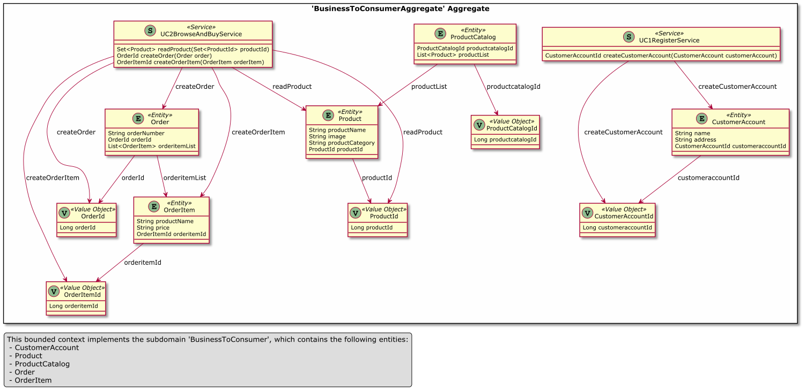

# *DPR* Tutorial 1: API Design in an Online Shop Scenario

*Note to reviewers:* This tutorial is not complete yet, but hopefully it is helpful already (or can at least give an idea of what is coming). Bear with us if you spot inconsistencies or information is still missing.

We continue the story from [Quick Start Tutorial 0](DPR-Tutorial0.md) and assume you have been assigned the role of API product owner for a fictitious online shop and its APIs. You decided to use elements from DPR to support your architecture design work.


## Featured Activity: Stepwise Service Design 

Let's now walk through the main API design activity in DPR, [Stepwise Service Design](../activities/SDPR-StepwiseServiceDesign.md). Please open the activity page and keep it open while going through the seven steps in this online shop example.  


### Step 1: Gather Requirements, Make Scoping Decisions
<!-- TODO (all steps) summarize purpose, input and output of step from [activity description](activities/SDPR-StepwiseServiceDesign.md)? -->

Two obvious [use cases](../artifact-templates/DPR-UseCase.md) in our sample scenario are specified in a [brief](https://contextmapper.org/docs/user-requirements/) format that unveils the required data and their relations just a bit: 

~~~
UseCase UC1_Register {
    actor = "Online Shopper"
    interactions = create a "CustomerAccount"  
    benefit "shop online and do not have to leave home"
}

UseCase UC2_BrowseAndBuy {
    actor = "Online Shopper"
    interactions = 
      read a "Product" in a "ProductCatalog",
      create an "Order" with its "OrderNumber",  
      create an "OrderItem" in an "Order" 
    benefit "get best price"
}
~~~

A specific and measurable [Non-Functional Requirement (NFR)](../activities/DPR-SMART-NFR-Elicitation.md) is: 

* 80% of all executions of "UC1_Register" should produce a correct response (user account created or error reported) in less than 3 seconds on average, measured at the system boundary of the shop (so excluding external network communication).

Scoping decisions might include (we could capture them as [Y-Statements](../artifact-templates/DPR-ArchitecturalDecisionRecordYForm.md); see Step 6 for an example of such statement): 

* Build the shop components rather than buy or rent them.
* Use a [microservices architecture](https://microservice-api-patterns.org/introduction) whose service components are identified with [Domain-Driven Design (DDD)](https://www.ost.ch/en/research-and-consulting-services/computer-science/ifs-institute-for-software-new/cloud-application-lab/architectural-refactoring-for-the-cloud-arc/domain-driven-design-ddd). 
* Reuse architectural knowledge by applying patterns.
* Develop in JavaScript (frontends) and Java (backends).
* Integrate an external payment service. <!-- TODO feature in SCD etc. -->

Note that these assumptions and decisions merely scope the tutorial; you'll be able to learn about the DPR way of API and architecture design without being knowledgeable in any of the technologies and concepts mentioned.


### Step 2: Model Domain, Make/Support Business Decisions
<!-- summarize purpose, input and output of step -->

When analyzing the two use cases from Step 1, the following [tactic DDD](../activities/DPR-TacticDDD.md) pattern instances may capture the analysis results (note that several entity attributes have been added; the Step 1 stories did not mention them explicitly, but justify their introduction implicitly):

<!-- CML source (also appears in models subfolder): 
~~~
Domain ECommerce {
	Subdomain BusinessToConsumer supports UC1Register , UC2BrowseAndBuy {
		domainVisionStatement "Aims at promoting the following benefit for a OnlineShopper: shop online and do not have to leave home; Aims at promoting the following benefit for a OnlineShopper: get best price"
		Entity CustomerAccount {
			String name
			String address
		}
		Entity Product {
			String productName
			String image
			String productCategory
		}
		Entity ProductCatalog {
			- List<Product> productList
		}
		Entity Order {
			String orderNumber
			- List<OrderItem> orderitemList
		}
		Entity OrderItem {
			String productName
			String price
		}
		Service UC1RegisterService {
			createCustomerAccount;
		}
		Service UC2BrowseAndBuyService {
			readProduct;
			createOrder;
			createOrderItem;
		}
	}
}
~~~
-->

<!-- TODO show subset only? or OOA rather than OOD model? talk reader through figure, explain which tool was used to create it -->

 

The above diagram qualifies as the visual part of the [domain model](../artifact-templates/DPR-DomainModel.md); on a real project, all figure/diagram elements would be explained (here or in a separate glossary).


### Step 3: Make Executive Decisions (incl. Client/Server Cuts, Frontends/Backends)
<!-- summarize purpose, input and output of step -->

Let us assume that the following [architectural decisions](../activities/DPR-ArchitecturalDecisionCapturing.md) have been made already (if not, we should make them now):

* Two-tier client server (patterns: remote user interface, distributed application kernel)
* <!-- Reactive --> JavaScript Web frontend
* Java Spring backend 

A very basic [Context Map](../artifact-templates/DPR-StrategicDDDContextMap.md) for this scenario (resulting from [Strategic DDD](../activities/DPR-StrategicDDD.md)) is:


### Step 4: Identify Service Candidates, Select Architectural Patterns
<!-- summarize purpose, input and output of step -->

Follow the instructions and hints in the activity and artifact pages to produce a [Candidate Endpoint List](../artifact-templates/SDPR-CandidateEndpointList.md). 

Such list can be derived from the Step 2 domain model and Step 3 architecture design and may look like this:

| Endpoint | Operation | Responsibility/Exposed Data | 
|----------|-----------|-----------------------------|
| Customer | create    | Create an account | 
| Product  | read      | Provide information about product category, price, etc.; possibly also suppliers, shipment time, taxes | 
| Order    | create    | Model purchase items the order consists of; point to customer; calculate tax and discounts |
| Order Item | add to order | Specify amount bought, reference product |

These candidate endpoints outline a [Service Layer](https://martinfowler.com/eaaCatalog/serviceLayer.html) of the backend under construction. The table does not say much about Remote Facades and Data Transfer Objects (DTOs) yet; this is something to be improved in the next step.

<!--
We skip additional architectural decision making here for the sake of brevity; on a real project, one would make quite a few decisions now. See Step 6 for an example of an Architectural Decision Record (ADR). -->


### Step 5: Refine Service Candidates, Make More Conceptual Architectural Decisions
<!-- summarize purpose, input and output of step -->

The API that is required to satisfy the requirements can be summarized as:

~~~
API name: Online Shop API

Identified in: Steps 1 to 3 from above; Step 4 CEL
Direction: Frontend Integration
Visibility: Solution-Internal API

Endpoints in this API (and their architectural role): 

1. Endpoint 1: Customer, responsible for account management (use case UC1_Register)
2. Endpoint 2: Product, responsible for master data management (use case UC2_BrowseAndBuy)
3. Endpoint 3: Order, implements "checkout" activity in shopping process (supports use case UC2_BrowseAndBuy)
~~~

The endpoint-level [Refined Endpoint List](../artifact-templates/SDPR-RefinedEndpointList.md) that refactors and refines the output from the previous Step 4 may then contain the following entries:

<!-- TODO (v2) maybe add more than just "Custom JSON" Media Type/Profile? -->

| Endpoint | Operation   | Responsibility Pattern (MAP) | Published Language (Request and Response Message Payload) | Media Type/Profile |
|----------|-------------|---------------|------------------------|-------------|
| Customer |             | [*Master Data Holder*](https://microservice-api-patterns.org/patterns/responsibility/informationHolderEndpointTypes/MasterDataHolder) |                 |             |
|          |  create (POST) | [*State Creation Operation*](https://microservice-api-patterns.org/patterns/responsibility/operationResponsibilities/StateCreationOperation) | *in:* account name, *out:* returns account name (and/or details) | Custom JSON |
| Product Catalog |             | *Master Data Holder* |                 |             |
|   |  search (GET) | [*Retrieval Operation*](https://microservice-api-patterns.org/patterns/responsibility/operationResponsibilities/RetrievalOperation) | *in:* search parameters, *out:* returns set of product descriptions, possibly paginated | Custom JSON |
| Order |             | [*Operational Data Holder*](https://microservice-api-patterns.org/patterns/responsibility/informationHolderEndpointTypes/OperationalDataHolder) |                 |             |
|      |  create (POST) | [*State Creation Operation*](https://microservice-api-patterns.org/patterns/responsibility/operationResponsibilities/StateCreationOperation) | *in:* products to be bought, *out:* returns order confirmation and/or DTO (containing items) | Custom JSON |
|      |  add (PUT) | [*State Transition Operation*](https://microservice-api-patterns.org/patterns/responsibility/operationResponsibilities/StateCreationOperation) | *in:* items to be added, *out:* returns order item id as confirmation | Custom JSON |

We have decided for endpoint and operation responsibilities on a conceptual level now; see the following Step 6 for an example of an ADR that continues the design decision making (on a technology level).


### Step 6: Specify Service Contract, Make Technology Decisions
<!-- summarize purpose, input and output of step -->

One of the architectural decisions might be (formatted as a [Y-Statement](../artifact-templates/DPR-ArchitecturalDecisionRecordYForm.md)):

```plain
In the context of the OnlineShopBackend subsystem,
facing the need to serve a number of technically diverse clients, 
we decided for RESTful HTTP on maturity level 2  
and neglected other protocols such as gRPC or SOAP/HTTP
to achieve interoperability, evolvability and auditability
accepting that static contracts and workflows do not comply with the REST level 3 vision of HATEOAS
because the implementation effort on client and server side required for hypermedia-driven state transitions 
is not justified in this scenario (not requiring dynamic workflows) 
and there is good contract language and tool support (OpenAPI, Swagger tools).
```

<!-- This would  the only place in the tutorial we talk about Layers (SSD activity has it), so removed "in the Service Layer" from "we decided for" (for now) now -->

The [API description](../artifact-templates/SDPR-APIDescription.md) that refines the output from Step 5 may look like this (notation: [Microservice Domain-Specific Language (MDSL)](https://microservice-api-patterns.github.io/MDSL-Specification/)):

<!-- TODO (v2): show MAP decorators too? addGraphQL (why n files?); TODO (v1.2) recreate file after API name change -->
~~~
API description OnlineShopBackend

data type CustomerAccount { "name":D<string>, "address":D<string>, "customeraccountId":CustomerAccountId }
data type CustomerAccountId { "customeraccountId":D<long> }
data type Order { "orderNumber":D<string>, "orderId":OrderId, "orderitemList":OrderItem* }
data type OrderId { "orderId":D<long> }
data type OrderItem { "productName":D<string>, "price":D<string>, "orderitemId":OrderItemId }
data type OrderItemId { "orderitemId":D<long> }
data type Product { "productName":D<string>, "image":D<string>, "productCategory":D<string>, "productId":ProductId }
data type ProductId { "productId":D<long> }

endpoint type Customer
  exposes
	operation createAccount
	  expecting
		payload CustomerAccount
	  delivering
		payload CustomerAccountId
		
endpoint type ProductCatalog
  exposes
	operation readProductInformation
	  expecting
		payload ProductId*
	  delivering
		payload Product*
		
endpoint type OrderBasket
  exposes
	operation createOrder with responsibility "POST"
	  expecting
		payload Order
	  delivering
		payload OrderId
	operation addOrderItem with responsibility "PUT"
	  expecting
		payload OrderItem
	  delivering
		payload OrderItemId

API provider OnlineShopFeaturesBackendProvider
	offers BusinessToConsumerAggregateBackend
	at endpoint location "http://..."
		via protocol HTTP
~~~ 

The [MDSL command line tools](https://github.com/Microservice-API-Patterns/MDSL-Specification/tree/master/dsl-core/io.mdsl.cli) can transform this technology-independent service contract into [OpenAPI](./contracts/DPR-Tutorial1Step6.yaml), [gRPC Protocol Buffers](./contracts/DPR-Tutorial1Step6.proto), and [Jolie](./contracts/DPR-Tutorial1Step6.ol). <!-- TODO GQL, WSDL/XSD, Java --> 

<!-- TODO (v2): add some code-level implementation decision(s), in MADR or e-ADR? -->
We also do not show how to implement the contract yet, for instance in Spring Boot and Java. Have a look at Step 7 of this [demo for tool-supported API design and service identification](https://ozimmer.ch/practices/2020/06/10/ICWEKeynoteAndDemo.html) for such information. 


### Step 7: Improve and Evolve Service Design
<!-- summarize purpose, input and output of step -->

In this phase, we may want to optimize message sizes and exchange frequency (updating API description and architectural decision log accordingly):

* Decide to add [Pagination](https://microservice-api-patterns.org/patterns/structure/compositeRepresentations/Pagination) to product search.
* Decide to introduce a [Wish List](https://microservice-api-patterns.org/patterns/quality/dataTransferParsimony/WishList) to product search. 

Keep on deciding and addressing design issues as they emerge: 

* Which security policies and audit controls are required (authentication, authorization, encryption, and so on)? (@Julisch:2011, @Schumacher:2013)
* Should API calls be billed? (@Zimmermann:2020)
* Are service level agreements required? (@Zimmermann:2020)

See Microservice API Patterns (MAP) [Tutorial 1](https://microservice-api-patterns.org/patterns/tutorials/tutorial1) and [Tutorial 2](https://microservice-api-patterns.org/patterns/tutorials/tutorial2) for more examples of API design work related to quality and evolution concerns.

<!--
## Quick Links

* [Activities and techniques](../activities) overview/index
* [Artifacts and templates](../artifact-templates) overview/index 
* [Roles and personas](../roles) overview/index
-->

### DPR Metadata

```yaml
title: "Design Practice Repository (DPR): Tutorial 1 (Online Shop API Design)"
author: Olaf Zimmermann (ZIO)
date: "12, 04, 2020 (Source: Project DD-DSE)"
copyright: Olaf Zimmermann, 2020 (unless noted otherwise). All rights reserved.
license: Creative Commons Attribution 4.0 International License
```